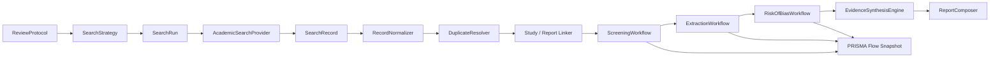

# ResearchGroup-Agent 系统综述级研究工作台升级计划

**制定日期：** 2026-05-17  
**承接文档：** `plan_/5.16/2026-05-16_evidence_grounded_research_workbench_upgrade_plan.md`  
**目标定位：** 从“可信证据驱动的半自动研究工作台”，继续升级为“可支撑系统综述方法学流程的研究工作台底座”  
**当前基线：** 已具备 `Run / Task / Output / Review / Approval / Claim / Evidence / Experiment` 基础链路，已完成可信文献约束、Tavily 网络检索入口、`auto / hitl` 模式切换、可复现实验闭环初版。

---

## 0. 一句话结论

下一阶段不应继续优先“加更多 Agent”，而应优先补齐 **系统综述级研究基础设施**：

1. 多源学术检索层；
2. 文献去重、筛选、来源质量分级与可追溯审计；
3. Evidence Workbench；
4. 在前 3 项稳定后，再扩展自动研究循环。

系统要先成为一个 **能把研究过程记录清楚、把证据边界说清楚、把不确定性保留下来** 的工作台，之后才值得继续提高自治程度。

---

## 1. 为什么必须往“系统综述级”架构上搭

当前系统已经解决了一个关键问题：研究生 Agent 不能再随意伪造参考文献。  
但如果继续向“真实系统性研究”前进，仅仅做到“先检索、再生成”还不够，必须继续覆盖以下方法学链路：

```text
研究问题
→ 协议与纳排标准
→ 多库检索
→ 检索式版本化
→ 记录导入与去重
→ 标题/摘要筛选
→ 全文筛选
→ 数据提取
→ 偏倚风险评估
→ 证据综合
→ PRISMA 流程透明化
→ 报告生成与可追溯复核
```

其中，PRISMA 2020 强调系统综述报告应包含可复核的 checklist 与 flow diagram；PRISMA-S 强调检索过程本身也需要完整、可复现地报告；Cochrane Handbook 则把检索、研究筛选、结构化数据提取和风险偏倚评估视为系统综述的核心过程。  

**结论：** 未来的核心不是“让 Agent 更会写”，而是“让系统天然按照系统综述方法学组织研究对象和工作流”。

---

## 2. 当前系统位置判断

### 2.1 已经具备的基础

当前仓库已经有以下可复用资产：

- 研究执行主链路：
  - `Run / Task / Output / Review / Approval`
- 研究对象基础：
  - `research_briefs`
  - `research_hypotheses`
  - `research_claims`
  - `research_decisions`
  - `research_uncertainties`
- 证据对象基础：
  - `evidence_sources`
  - `evidence_claims`
  - `evidence_excerpts`
  - `evidence_assessments`
  - `evidence_links`
- 当前外部能力：
  - Tavily 网络搜索工具边界
  - Crossref 初始检索支持
  - 本地附件 / 手动元数据入口
- 当前可信度防线：
  - 文献任务执行前先检索
  - `allowed_sources` 白名单约束
  - 引用后校验
  - 无可信来源时显式返回 `insufficient_evidence`

### 2.2 仍然缺失的关键能力

目前仍缺：

- 多源学术数据库接入与 provider 抽象；
- 检索策略对象化、版本化和复现；
- 研究记录级去重，而不只是 URL / DOI 粗去重；
- “报告（report）”与“研究（study）”区分；
- 双阶段筛选与排除理由记录；
- 数据提取表单；
- 偏倚风险评估；
- PRISMA flow 自动汇总；
- 面向证据链的工作台界面；
- 跨轮次的 living review / update 能力。

### 2.3 这一阶段的真正目标

本阶段不追求让系统直接替代研究者完成完整系统综述，而是要先把底层对象、流程和扩展口建对。  
如果这一层建歪，后续再接更多数据库、PDF 解析、meta-analysis 或自动筛选都会被迫推倒重来。

---

## 3. 设计原则

### 3.1 研究对象优先，Agent 只是执行者

系统的一级对象应是：

- `ReviewProtocol`
- `SearchStrategy`
- `SearchRun`
- `SearchRecord`
- `Study`
- `ScreeningDecision`
- `ExtractionForm`
- `RiskOfBiasAssessment`
- `SynthesisResult`
- `PrismaFlowSnapshot`

而不是“某个 Agent 说了什么”。  
Agent 负责加工这些对象，不负责替代对象本身。

### 3.2 检索可复现优先于检索看起来很多

必须能回答：

- 用了哪些数据库；
- 每个数据库的检索式是什么；
- 哪天执行；
- 返回多少条；
- 去重前后各多少条；
- 哪些记录为什么被排除；
- 证据链如何支撑结论。

### 3.3 先保证“不能胡说”，再追求“尽量自动”

系统自治度的提升顺序必须是：

```text
可追溯
→ 可复核
→ 可解释
→ 半自动
→ 自动
```

不能反过来。

### 3.4 保留 HITL，不把方法学审查偷换成按钮

系统综述级别里，人工确认不是“麻烦”，而是质量控制的一部分。  
`auto` 模式可以用于低风险自动推进，但以下节点必须始终保留人工介入能力：

- 协议冻结；
- 纳排标准确认；
- 检索式批准；
- 高冲突去重合并；
- 全文排除；
- 风险偏倚判断；
- 最终综合结论发布。

---

## 4. 任务边界

### 4.1 本计划必须做的事

1. 建立 **多源学术检索层**，先让系统具备可扩展的 provider 体系；
2. 建立 **检索记录级治理链路**，完成标准化、去重、筛选、排除理由和质量标签；
3. 建立 **Evidence Workbench**，让用户能看见研究对象之间的真实关系；
4. 在上述基础上，补齐 **自动研究循环的可控触发条件**；
5. 所有新增能力都必须：
   - 可配置；
   - 可审计；
   - 可测试；
   - 可在 `.env` 中控制；
   - 对 `MOCK_MODE=true` 友好。

### 4.2 本阶段明确不做的事

本阶段**严禁**把范围失控成下面这些内容：

- 不做自动发表论文；
- 不做“系统自动宣称完成一篇真实可投稿 meta-analysis”；
- 不做复杂统计分析平台；
- 不做自动生成不可复核的“专家判断”；
- 不做 PDF OCR / 版面解析大工程；
- 不做 Zotero / Overleaf / Notion / 机构数据库的一次性全接入；
- 不做多租户、权限系统、团队协作权限；
- 不把 Tavily 当作学术真值源；
- 不允许任何 Agent 绕过来源白名单直接生成引用；
- 不允许“为了让流程继续走”而自动篡改纳排标准；
- 不允许把高不确定性的系统结论伪装成“已证实”。

### 4.3 当前阶段和后续阶段的分界

| 能力 | 当前阶段目标 | 后续再做 |
|---|---|---|
| 多源检索 | provider 抽象 + 3~4 个学术源接入 | 更大规模数据库生态、机构订阅库 |
| 去重 | DOI / PMID / arXiv / 标题作者年份 / 模糊匹配 | 引用图谱级实体消歧 |
| 筛选 | 标题摘要 + 全文状态流转 + 排除理由 | 自动优先级排序、主动学习筛选 |
| 数据提取 | 结构化表单框架 | 复杂领域模板市场 |
| 偏倚评估 | 框架与适配器 | 完整领域评分工具库 |
| 综合 | narrative synthesis 结构 | meta-analysis、network meta-analysis |
| 更新 | 预留 living review 接口 | 真正的定期更新与变更检测 |

---

## 5. 目标架构总图



### 5.1 分层说明

#### A. 协议层

负责定义研究要做什么：

- 研究问题；
- PICO / SPIDER / 其他问题框架；
- 纳排标准；
- 目标研究类型；
- 主要和次要结局；
- 预期综合方式；
- 版本冻结。

#### B. 检索层

负责回答“从哪里找、怎么找、何时找”：

- 多 provider；
- 检索式转换；
- 检索式版本；
- 检索执行记录；
- provider 返回结果标准化。

#### C. 记录治理层

负责把“搜到的报告”变成“可管理的研究对象”：

- record normalization；
- duplicate detection；
- report-to-study linking；
- conflict resolution；
- provenance tracking。

#### D. 证据处理层

负责把研究对象推进到可用于综合：

- screening；
- extraction；
- risk of bias；
- certainty / confidence；
- synthesis。

#### E. 工作台层

负责把方法学过程透明地呈现给用户：

- 搜索结果；
- 去重簇；
- 筛选队列；
- 排除理由；
- claim / evidence / study / experiment 关系；
- PRISMA 流转；
- unresolved conflicts；
- intervention queue。

---

## 6. 开发优先级总表

| 优先级 | 阶段 | 目标 | 为什么先做 |
|---|---|---|---|
| P0 | 多源学术检索层 | 让系统找到“对的东西” | 没有可靠输入，后面全是假象 |
| P1 | 文献治理与筛选 | 让系统知道“这些东西是什么、哪些能留下” | 系统综述的核心不是搜到，而是筛得清楚 |
| P2 | Evidence Workbench | 让用户能复核证据链 | 没有可视化，就没有真正的质量控制 |
| P3 | 自动研究循环 | 让系统基于缺口继续推进 | 只有前面可信，自动化才有价值 |

---

## 7. P0：多源学术检索层

### 7.1 目标

把当前“EvidenceProvider + Tavily / Crossref 初版”升级成真正可扩展的 **Academic Retrieval Platform**。

### 7.2 必做任务

#### 7.2.1 定义 provider 抽象

新增接口：

```python
class AcademicSearchProvider(Protocol):
    name: str

    def capabilities(self) -> ProviderCapabilities: ...
    def search(self, request: SearchRequest) -> SearchResponse: ...
    def normalize(self, raw_item: dict) -> SearchRecordDraft: ...
```

必须统一：

- query；
- database name；
- pagination；
- rate limit；
- cursor；
- source identifiers；
- raw payload；
- fetched_at；
- provider warnings。

#### 7.2.2 先接入的 provider 顺序

1. `Crossref`
2. `Semantic Scholar`
3. `arXiv`
4. `Tavily` 继续保留，但定位为 **补充网络检索 / 灰色信息发现**，不是主要学术来源

#### 7.2.3 建立检索策略对象

新增对象：

- `ReviewProtocol`
- `SearchStrategy`
- `SearchStrategyVersion`
- `SearchRun`

必须支持：

- 一个 review protocol 下有多条数据库策略；
- 每条策略有版本；
- 每次执行形成不可变快照；
- 执行结果可复现；
- 后续支持 PRISMA-S 报告。

#### 7.2.4 新增数据库表

建议新增：

- `review_protocols`
- `search_strategies`
- `search_strategy_versions`
- `search_runs`
- `search_run_providers`
- `search_records`
- `search_record_identifiers`

#### 7.2.5 前端设置与运行入口

设置页新增：

- 各 provider 开关；
- API Key；
- provider 优先级；
- 单次检索最大返回量；
- 是否允许网络灰色检索参与候选召回；
- 是否要求系统综述模式下至少启用多少个学术源。

工作台新增：

- “检索策略”页；
- “执行检索”按钮；
- “查看原始检索快照”入口；
- “导出搜索记录”入口。

### 7.3 明确不做

- 不把所有数据库一次性接完；
- 不在 provider 层做研究结论判断；
- 不在检索阶段直接删结果；
- 不允许 provider 返回后直接进入报告；
- 不以 Tavily 搜索结果替代学术数据库检索。

### 7.4 验收标准

- 至少 3 个学术 provider 可配置、可启停；
- 相同检索策略可重复执行并生成独立 `SearchRun`；
- 每个 `SearchRecord` 都保留来源 provider 与原始标识；
- provider 故障不会破坏其他 provider；
- `MOCK_MODE=true` 下可跑完整 smoke；
- PRISMA-S 所需的核心字段已可落库。

### 7.5 推荐提交拆分

1. `抽象学术检索提供方接口`
2. `接入多源学术检索提供方`
3. `新增检索策略与检索执行模型`
4. `补充学术检索前端配置与验收脚本`

---

## 8. P1：文献治理、筛选与来源质量分级

### 8.1 目标

把“搜到一堆 source”升级为“可审计的系统综述记录治理链路”。

### 8.2 必做任务

#### 8.2.1 记录标准化

把不同 provider 返回统一为：

- `record_id`
- `provider`
- `title`
- `abstract`
- `authors`
- `year`
- `doi`
- `pmid`
- `arxiv_id`
- `url`
- `publication_type`
- `language`
- `journal`
- `raw_payload`

#### 8.2.2 去重引擎

新增 `DuplicateResolver`，分层处理：

1. 精确标识去重：
   - DOI
   - PMID
   - arXiv ID
2. 规范化标题 + 年份 + 首作者；
3. 模糊匹配候选；
4. 人工确认冲突簇。

新增对象：

- `DeduplicationCluster`
- `DeduplicationDecision`
- `RecordMergeAudit`

#### 8.2.3 report / study 分离

必须区分：

- `SearchRecord`：检索到的一条报告记录；
- `Study`：一个真实研究；
- `StudyReportLink`：一个研究可对应多个报告。

这一步是系统综述级架构的关键。否则同一研究多篇论文会被错误地重复计数。

#### 8.2.4 双阶段筛选

新增：

- `ScreeningStage`
  - `title_abstract`
  - `full_text`
- `ScreeningDecision`
- `ExclusionReason`

每一次排除都必须：

- 有阶段；
- 有理由；
- 有操作者；
- 有时间；
- 可复核。

#### 8.2.5 来源质量分级

把当前简单的 `credibility_score` 升级为更明确的标签体系：

- 来源类型；
- 是否同行评议；
- 是否原始研究；
- 是否预印本；
- 是否摘要会刊；
- 是否全文可得；
- 是否存在撤稿 / 更正风险；
- 是否满足 protocol 目标研究类型。

#### 8.2.6 纳排标准绑定

筛选不是自由文本判断，必须绑定：

- `ReviewProtocol`
- `EligibilityCriterion`
- `CriterionDecision`

### 8.3 明确不做

- 不让 Agent 直接决定“排除就排除”而不留原因；
- 不把所有同题目论文强行 merge；
- 不用一个粗糙 relevance score 取代筛选决策；
- 不自动把灰色文献和正式论文混成同一可信等级；
- 不在没有全文时假装完成全文筛选。

### 8.4 验收标准

- 去重前后数量可解释；
- 任一记录的保留 / 排除都可追溯；
- 一个 study 可关联多个 report；
- 系统能输出：
  - 检索总数
  - 去重后数量
  - 标题摘要筛选排除数
  - 全文排除数
  - 最终纳入数
- 对任意最终 claim，可追溯到 study / report / excerpt。

### 8.5 推荐提交拆分

1. `新增检索记录标准化与研究实体模型`
2. `实现文献去重簇与合并审计`
3. `实现双阶段筛选与排除理由`
4. `补充来源质量分级与筛选验收脚本`

---

## 9. P2：Evidence Workbench

### 9.1 目标

把现在“后端已经有证据对象”升级成“用户可以真正复核研究过程”的工作台。

### 9.2 必做页面

#### 9.2.1 Review Overview

展示：

- review protocol；
- 当前状态；
- 已启用 provider；
- 最近一次检索时间；
- PRISMA 核心计数；
- 阻塞项；
- 需要人工确认的高风险节点。

#### 9.2.2 Search & Dedup

展示：

- 检索策略；
- 各 provider 返回量；
- 去重簇；
- 冲突记录；
- 待人工确认 merge。

#### 9.2.3 Screening Queue

展示：

- 标题摘要筛选队列；
- 全文筛选队列；
- 纳排标准；
- 排除理由统计；
- unresolved conflict。

#### 9.2.4 Evidence Matrix

展示：

- `claim -> study -> report -> excerpt`
- 支持 / 反驳 / 不确定；
- 来源质量标签；
- 风险偏倚状态；
- 引用链完整度。

#### 9.2.5 PRISMA Flow

展示：

- 搜索总数；
- 去重后数量；
- 筛选数量；
- 全文评估数量；
- 排除数量与原因；
- 最终纳入数量。

### 9.3 关键交互原则

- 用户必须能从结论一路点回原始记录；
- 所有自动决策都必须可展开查看依据；
- 所有人工决策都必须能看到是谁、何时、为什么；
- 不确定项必须显式呈现，不能藏在“已完成”里；
- UI 不只展示结果，也要展示研究过程的缺口。

### 9.4 明确不做

- 不做炫技型大屏；
- 不做 3D；
- 不把 Evidence Workbench 做成单纯 dashboard；
- 不把复杂方法学状态压缩成一个“可信度百分比”；
- 不把 reviewer 冲突偷偷自动吞掉。

### 9.5 验收标准

- 用户可以从任一 claim 逆向追溯到支撑它的证据；
- 用户可以从任一 study 正向看到筛选、提取、偏倚、综合状态；
- PRISMA flow 与底层数据一致；
- workbench 可以明确告诉用户：
  - 哪些研究已纳入；
  - 哪些仍待处理；
  - 哪些结论证据不足；
  - 哪些节点需要人介入。

### 9.6 推荐提交拆分

1. `新增系统综述总览页`
2. `新增检索去重工作台`
3. `新增筛选队列与排除理由视图`
4. `新增证据矩阵与PRISMA流程图`

---

## 10. P3：自动研究循环

### 10.1 目标

在多源检索、证据治理和工作台稳定后，再让系统基于“研究缺口”继续推进，而不是只按既定 task graph 顺序执行。

### 10.2 必做任务

新增：

- `GapAnalyzer`
- `NextBestActionPolicy`
- `StopConditionEvaluator`
- `HumanInterventionPolicy`
- `LivingReviewScheduler`（先留接口，不立即做完整调度）

### 10.3 可触发的自动动作

- 证据不足时：
  - 生成补充检索建议；
  - 扩展 provider；
  - 建议人工复核检索式；
- 存在冲突证据时：
  - 触发反证搜集；
  - 建议细化纳排标准；
- 某假设未被实验验证时：
  - 生成实验 protocol；
- 存在长期未解决不确定性时：
  - 进入 intervention queue。

### 10.4 自动化必须遵守的硬约束

- 不得自动修改已冻结 protocol；
- 不得自动发布最终结论；
- 不得在没有足够证据时把 claim 升级为 supported；
- 不得绕过未解决的高风险 reviewer conflict；
- 不得把“补充检索建议”伪装成“已经完成证据补全”。

### 10.5 验收标准

- 系统能基于明确 gap 生成下一步动作；
- 自动动作都有触发依据；
- 高风险动作都能被 HITL 截住；
- 停止条件明确：
  - 证据充分；
  - 预算耗尽；
  - 冲突待人工；
  - 无新增可行研究动作。

### 10.6 推荐提交拆分

1. `新增研究缺口分析服务`
2. `新增下一步动作策略与停止条件`
3. `接入自动研究循环审计链路`
4. `补充自动循环功能验收脚本`

---

## 11. 必须预留的后续接口

### 11.1 检索接入接口

```python
AcademicSearchProvider
SearchQueryTranslator
ProviderCapabilityRegistry
ProviderAuthConfig
```

后续预留接入：

- PubMed
- OpenAlex
- Semantic Scholar
- arXiv
- Crossref
- Zotero
- 机构订阅数据库

### 11.2 文档与全文接口

```python
FullTextResolver
DocumentParser
PdfIngestionProvider
RetractionCheckProvider
```

### 11.3 方法学接口

```python
EligibilityPolicy
ScreeningPolicy
ExtractionSchemaProvider
RiskOfBiasToolAdapter
CertaintyAssessmentAdapter
EvidenceSynthesisEngine
```

### 11.4 外部协作接口

```python
ProtocolRegistryAdapter
CitationManagerAdapter
ExportAdapter
NotificationAdapter
```

预留但本阶段不实现：

- PROSPERO；
- Zotero；
- RevMan；
- Overleaf；
- CSV / RIS / BibTeX 导入导出增强；
- living review 定期订阅。

---

## 12. 建议新增的数据模型

### 12.1 研究协议与检索

- `review_protocols`
- `eligibility_criteria`
- `search_strategies`
- `search_strategy_versions`
- `search_runs`
- `search_run_providers`

### 12.2 记录治理

- `search_records`
- `search_record_identifiers`
- `deduplication_clusters`
- `deduplication_decisions`
- `studies`
- `study_report_links`

### 12.3 筛选与提取

- `screening_decisions`
- `exclusion_reasons`
- `extraction_forms`
- `extraction_fields`
- `extraction_records`

### 12.4 偏倚与综合

- `risk_of_bias_assessments`
- `certainty_assessments`
- `synthesis_batches`
- `synthesis_results`
- `prisma_flow_snapshots`

---

## 13. API 规划

### 13.1 协议与检索

```http
POST   /api/reviews
GET    /api/reviews/{review_id}
PATCH  /api/reviews/{review_id}

POST   /api/reviews/{review_id}/search-strategies
GET    /api/reviews/{review_id}/search-strategies
POST   /api/reviews/{review_id}/search-runs
GET    /api/reviews/{review_id}/search-runs
```

### 13.2 记录治理

```http
GET    /api/reviews/{review_id}/records
GET    /api/reviews/{review_id}/deduplication-clusters
POST   /api/deduplication-clusters/{cluster_id}/resolve
GET    /api/reviews/{review_id}/studies
```

### 13.3 筛选与提取

```http
GET    /api/reviews/{review_id}/screening-queue
POST   /api/screening-decisions
GET    /api/reviews/{review_id}/extraction-forms
POST   /api/extraction-records
```

### 13.4 风险偏倚与综合

```http
POST   /api/risk-of-bias-assessments
GET    /api/reviews/{review_id}/evidence-matrix
GET    /api/reviews/{review_id}/prisma-flow
```

---

## 14. 质量门槛与测试要求

### 14.1 代码质量

- 所有新增环境变量必须进入 `.env.example`；
- 所有 provider 必须有 capability 描述；
- 所有外部返回必须经过 normalize；
- 所有重要状态变更必须产生日志 / 事件；
- 所有方法学对象必须可序列化、可恢复；
- `MOCK_MODE=true` 必须完整可跑。

### 14.2 功能测试脚本

建议新增脚本顺序：

1. `functional_academic_retrieval_platform.py`
2. `functional_dedup_and_screening_pipeline.py`
3. `functional_evidence_workbench_contracts.py`
4. `functional_research_loop_policy.py`

### 14.3 必测场景

- provider 单独失败但整体可继续；
- 同一 DOI 多 provider 重复返回；
- 同一 study 多 report；
- 模糊去重冲突；
- 标题摘要排除；
- 全文排除；
- 证据不足；
- reviewer 冲突；
- 自动模式与 HITL 模式；
- PRISMA 计数一致性；
- 最终报告引用全链路可追溯。

---

## 15. 推荐开发顺序

### Milestone A：先把“搜”做对

- provider 抽象；
- SearchStrategy / SearchRun；
- Crossref / Semantic Scholar / arXiv；
- 搜索结果标准化。

### Milestone B：再把“管”做对

- 去重；
- study / report；
- screening；
- exclusion reason；
- source quality。

### Milestone C：再把“看”做对

- Overview；
- Dedup；
- Screening；
- Evidence Matrix；
- PRISMA Flow。

### Milestone D：最后把“继续研究”做对

- gap analyzer；
- next best action；
- stop condition；
- human intervention queue。

---

## 16. 明确的“严禁事项”

### 16.1 产品层

- 严禁把“系统综述级”偷换成“文献检索结果更多”；
- 严禁把前端做成只展示漂亮卡片、却看不到筛选逻辑；
- 严禁把不确定性隐藏在最终结论后面；
- 严禁将系统目标改成“自动写论文机器”。

### 16.2 工程层

- 严禁把 provider 逻辑重新塞回 `task_executor.py`；
- 严禁继续在一个 service 里同时做检索、去重、筛选、评估、报告；
- 严禁把数据库 schema 的未来扩展空间耗尽在一次性硬编码；
- 严禁用“标题字符串相同”作为唯一去重标准；
- 严禁高风险删除 / 合并无审计记录。

### 16.3 Agent 层

- 严禁 Agent 自造 DOI / URL / PMID；
- 严禁 Agent 修改已冻结 protocol；
- 严禁 Agent 在无依据时把 `needs_more_evidence` 改写为 `supported`；
- 严禁 SubAgent 绕过主 Agent 和研究对象层直接进入报告；
- 严禁为了降低阻塞率而牺牲真实性。

---

## 17. 最终成功标准

如果这一阶段完成，系统至少应能做到：

1. 用户创建一个 review protocol；
2. 系统对多个学术源执行版本化检索；
3. 系统保留完整 search run 快照；
4. 系统完成标准化与去重；
5. 用户或 Agent 依据纳排标准完成筛选；
6. 每条排除都能解释；
7. 每个 claim 都能追溯到 study / report / excerpt；
8. 工作台能展示 PRISMA 级研究流转；
9. 自动研究循环只围绕“明确 gap”推进；
10. 在没有证据时，系统仍然会诚实地停下。

到这个节点，ResearchGroup-Agent 才算真正从：

> `multi-agent research workflow simulator`

升级为：

> `systematic-review-aware evidence-grounded research workbench`

---

## 18. 推荐阅读标准与方法学依据

| 标准 / 资源 | 对本项目的作用 | 官方入口 |
|---|---|---|
| PRISMA 2020 | 约束最终系统综述报告的结构、checklist 与 flow diagram | <https://www.prisma-statement.org/prisma-2020> |
| PRISMA-S | 约束检索策略、数据库、执行日期、完整检索式的可复现报告 | <https://systematicreviewsjournal.biomedcentral.com/articles/10.1186/s13643-020-01542-z> |
| Cochrane Handbook Chapter 4 | 约束检索、记录管理、研究筛选和 report / study 区分 | <https://training.cochrane.org/handbook/current/chapter-04> |
| Cochrane Handbook Chapter 5 | 约束结构化数据提取 | <https://training.cochrane.org/handbook/current/chapter-05> |
| Cochrane Handbook | 约束风险偏倚评估、分析、解释等完整系统综述流程 | <https://training.cochrane.org/handbook/current> |
| PROSPERO | 为后续 protocol 注册适配器预留设计参照 | <https://www.crd.york.ac.uk/prospero/> |

这些标准的作用不是让项目“医学化”，而是帮助我们把 **可复现、可审计、可追溯** 这三个要求真正落到系统结构里。
