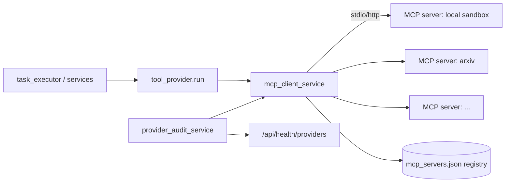
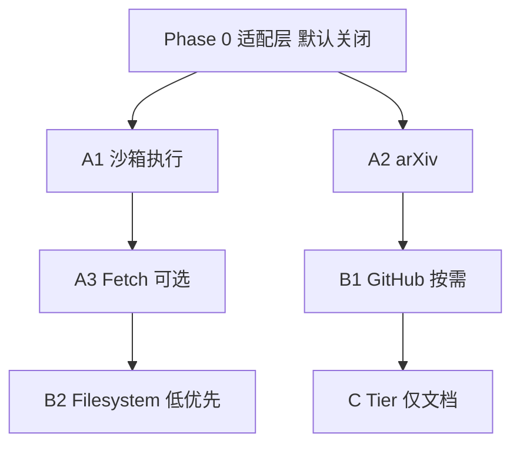

# MCP 接入计划（ABC 分档 + Phase 0 落地）

> 生成日期：2026-06-12
> 适用项目：ResearchGroup-Agent（多 Agent 模拟研究生课题组）
> 状态：MVP 基本形成，本计划在不破坏 MVP 边界的前提下，为系统补上"可被调用的工具手（MCP）"。

---

## 1. 背景与现状

- 研究系统**目前没有 MCP client**：5 类研究生 Agent 通过直接调用 `backend/app/services/` 下的 Python service 来获得能力（LLM、学术检索、browser-use、子进程实验执行、matplotlib 画图等）。
- 环境里出现的 `cursor-app-control` / `cursor-ide-browser` / `plugin-figma-figma` 三个 MCP server 属于 **Cursor 编码环境**，研究系统本身并不消费它们。
- 已存在两个天然接缝，便于挂载 MCP：
  - `backend/app/services/tool_provider.py` —— `run()` 当前抛 `NotImplementedError`，是 MCP 适配层的落点。
  - `backend/app/services/experiment_backend.py` —— `execute()` 是预留的可插拔执行后端，是 Tier A 沙箱接入点。
- 能力可观测性已有：`backend/app/services/provider_audit_service.py` → `GET /api/health/providers`。

## 2. 设计原则与 MVP 红线

项目 `AGENTS.md` 明确的 Never 项：
- 禁止接入外部工具（Zotero / Overleaf / Notion 等）。
- 禁止把 4 个预留接口（ToolProvider / AgentOrchestrator / SkillUpdateService / ExternalMemory）实现为产品功能。

因此本计划遵循：
1. **默认全关**：所有 MCP 行为由 `mcp_enabled` 总开关 + 每个 server 的 `enabled` 双开关控制，默认关闭即等于现状，零回归、可即时回退。
2. **不改 Agent 决策路径**：Phase 0 只提供"可被调用的手 + 可观测性"，不改变任务流程。
3. **强化优先于扩张**：Tier A 仅强化系统已有的核心能力；扩范围（Tier B）和越界项（Tier C）分级隔离，越界项仅文档化。

## 3. 适配层架构（Phase 0）

## 4. Phase 0 — 基础适配层（本次实现，默认关闭）

| 项 | 内容 |
|---|---|
| 依赖 | `uv add mcp`（官方 Python SDK，含 stdio + streamable-http client），同步 `requirements.txt` 与 `pyproject.toml` |
| 配置 | `config.py` + `.env.example` 增加 `mcp_enabled`(默认 false)、`mcp_servers_config`(注册表路径)、`mcp_call_timeout_seconds`(默认 60) |
| 注册表 | 新增 `backend/app/data/mcp_servers.json`，每项 `{name, tier, enabled, transport, command/args 或 url}`，初始全部 `enabled: false`（占位示例：local-sandbox、arxiv） |
| 客户端 | 新服务 `backend/app/services/mcp_client_service.py`：`list_servers()` / `list_tools(server)` / async `call_tool(server, tool, args)`，按注册表懒连接；`mcp_enabled=false` 或 `mcp` 未安装时优雅降级（返回空能力、调用抛清晰错误，不影响现有流程） |
| 接线 | `tool_provider.py` 的 `run()` 委派给 `mcp_client_service`；`list_available()` / `capabilities()` 反映注册表中已启用的 server/tool（保留原 stub 字段不破坏调用方） |
| 可见性 | `provider_audit_service.audit()` 增加 `mcp` 段（enabled、servers、live tools），随 `/api/health/providers` 暴露 |
| 验证 | `mcp_enabled=false` 启动后端 + 调 `/api/health/providers` 确认无回归；最小 stdio MCP server 冒烟 `list_tools` / `call_tool` |

## 5. Tier A — 强化核心能力，不扩范围（后续实现）

| 编号 | MCP | 接入点 | 价值 |
|---|---|---|---|
| A1 | 代码沙箱执行 | `experiment_backend.execute()`；`EXPERIMENT_EXECUTION_BACKEND` 新增 `mcp_local`（mcp-run-python/Pyodide，首选）与 `mcp_e2b`（E2B，留配置项）。`reproducible_experiment_service.py` 在该 flag 下把脚本交给沙箱跑，默认仍走本地 `subprocess` | 把"做实验+画图"核心手放进隔离沙箱，安全性与可复现性更好；落地 `ExecutionSandbox` 预留点 |
| A2 | arXiv MCP | 作为新 provider 接入 `evidence_provider.py` 的 `search_with_trace()` 与 `list_capabilities()` | 检索+下载全文，与现有 arXiv 元数据、`fulltext_ingest` 互补 |
| A3 | Fetch MCP | 增强 `fulltext_ingest_service` 取证路径（可选） | 网页转 markdown，多一条取证通道 |

> A1 采用可插拔后端：先实现本地 `mcp_local`，`mcp_e2b` 留作配置项（按用户选择"both"）。

## 6. Tier B — 新增范围（按需启用）

| 编号 | MCP | 用途 | 备注 |
|---|---|---|---|
| B1 | GitHub MCP（官方） | 服务 `tool_integration` / 开源实现调研任务；对应 `tool_provider` 里的 `github_search` 空壳 | 新增外部依赖，需 token |
| B2 | Filesystem MCP（官方） | 让 Agent 读写 artifacts | 与现有 Python 直接读写重叠，低优先 |

## 7. Tier C — 触碰 MVP 红线（仅文档，默认禁用）

| MCP | 对应空壳 | 处置 |
|---|---|---|
| Zotero MCP | `zotero_connector` | 命中 `AGENTS.md` 严禁项，列为 post-MVP |
| Overleaf MCP | `overleaf_connector` | 同上 |
| Notion MCP | — | 同上 |

启用前置条件（post-MVP 再评估）：明确去除 `AGENTS.md` 中"禁止接入外部工具"的约束，并补充账号/密钥与隐私边界说明。

## 8. 实施顺序与里程碑

1. Phase 0（本次）：适配层 + 注册表 + 健康可见性，默认关闭。
2. Tier A：A1 → A2 →（A3 可选），每项独立开关灰度。
3. Tier B：按实际需求启用。
4. Tier C：保持文档化，不实现。

## 9. 风险与回退

- 双开关（`mcp_enabled` + per-server `enabled`）默认关闭，等价于现状，零回归。
- `mcp` 依赖即使未安装，`mcp_client_service` 也优雅降级，不影响后端启动与现有任务流。
- Phase 0 不接入任何 Agent 决策路径，纯增量；任意阶段可通过关开关回退。
