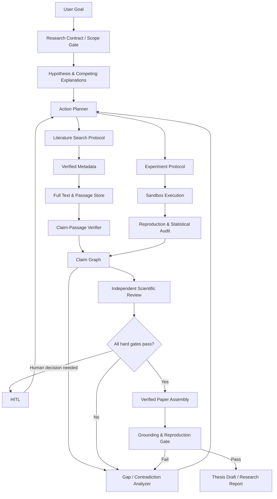

# ResearchGroup-Agent 自主科研能力深度诊断与升级进化路线图

**审计日期：** 2026-07-14

**审计对象：** 当前工作区代码、有效运行配置、测试与既有升级计划

**目标：** 解释系统为什么仍不能独立完成“研究生毕业课题级”研究，定位文献乱编的真实因果链，并给出可实施、可验收的升级顺序

**结论性质：** 本文是代码与架构审计，不是对某一次运行输出质量的主观评价

---

## 0. 一句话结论

当前项目已经从最初的“多 Agent 流程演示器”进化出真实检索、来源白名单、全文抓取、知识图谱、实验执行、研究循环和论文装配等模块；但这些模块多数仍处于**接口存在、语义未闭环**的阶段。

系统现在能够自动完成的是：

> 把一个目标拆成少量任务，调用若干次 LLM 和检索接口，运行一个小脚本，把输出组织成一份看起来像论文的 Markdown。

系统尚不能稳定完成的是：

> 定义一个可答的研究问题，系统地查全并读懂相关工作，提出有来源的创新假设，用真实数据和合格方法反复验证，在反证下主动改进方案，由独立审查者复核每个关键结论，最终形成可复现、可追溯、达到学术规范的毕业论文。

根本差距不是“模型还不够强”或“Agent 数量不够多”，而是系统尚未建立四个闭环：

1. **认识论闭环：** 问题 → 假设 → 可证伪预测 → 证据 → 反证 → 修正。
2. **文献证据闭环：** 检索记录 → 全文片段 → 具体 claim → 精确 locator → 引用。
3. **实验闭环：** 真实数据 → 预注册协议 → 可复现实验 → 统计检验 → 复跑/消融 → 结论。
4. **质量闭环：** 独立审查 → 阻断失败 → 返工 → 再验证 → 达标后发布。

只继续增加 Prompt、角色、搜索源或报告模板，不会自然产生这四个闭环。

---

## 1. 审计范围与方法

本次沿以下真实执行路径进行审计：

```text
Run 创建
→ ResearchState 初始化
→ TaskDecomposer 拆解
→ TaskGraph / Scheduler 分配
→ EvidencePipeline 检索与核验
→ TaskExecutor 生成
→ KnowledgeGraph 写入 claim/evidence link
→ ReproducibleExperiment 执行
→ ReviewService 审核与返工
→ ResearchLoop 扩展
→ ReportService / PaperAssembly 生成论文
→ GroundingAudit 审计
```

重点检查：

- 研究问题和假设是否由证据驱动，而不是模板化生成；
- Agent 是否能够自主选工具、观察结果并重规划；
- 文献是否真正被阅读，claim 是否对应原文片段；
- DOI、网页、全文与引用检查是否会阻断不可信来源；
- 实验是否针对任意课题生成真实方法与数据，而不是固定示例；
- 审核是否检查科学有效性，而不只是字段存在；
- 报告是否只呈现已验证结论；
- 自动研究循环是否能持续到问题真正收敛；
- 测试是否能测出“看似成功但学术上错误”的结果。

本次还读取了当前有效配置，但只检查开关和密钥是否存在，没有读取或记录任何密钥值。

### 1.1 当前有效配置快照

当前环境已经开启了大部分“真实研究”能力：

| 能力 | 当前有效状态 |
|---|---:|
| Mock 模式 | 关闭 |
| 真实 LLM 凭据 | 已配置 |
| Tavily 凭据 | 已配置 |
| Web Search | 开启 |
| Crossref / OpenAlex / arXiv / Semantic Scholar | 开启 |
| Browser Research / Verification | 开启 |
| Browser Verification Required | **关闭** |
| DOI Verification | 开启 |
| Full-text Ingest | 开启 |
| Research Agent Loop | 开启，最多 3 次 query 规划迭代 |
| Research Loop Auto Continue | 开启，最多 2 轮，每轮最多 3 个任务 |
| Citation Validation / Grounding Audit | 开启 |
| Generated Experiment Code / Local Execution | 开启 |
| Experiment Review | 开启 |
| Run Interaction Mode | **auto** |
| MCP | 关闭 |

因此不能把现状简单归因于“默认开关没开”。即使所有开关都开启，后续章节中的语义缺陷仍然存在。

---

## 2. “研究生毕业课题级”能力应满足什么

为了避免把“生成一篇长文”误当成“完成一项研究”，这里先冻结目标标准。

### 2.1 最低研究闭环

一个可被称为毕业课题级的系统，至少应做到：

1. 把宽泛题目收敛成范围明确、可回答、可证伪的研究问题；
2. 给出相关工作的系统检索策略，而不是只搜几个标题；
3. 读取并抽取与问题相关的原文片段、方法、数据、结果和局限；
4. 形成创新点候选，并证明它与现有工作不同；
5. 冻结实验协议、数据来源、基线、指标和停止规则；
6. 执行真实实验，至少包含重复运行、统计量、消融和失败分析；
7. 能因失败、反证或审查意见修改假设和方法；
8. 关键结论必须能追溯到原文片段或实验 artifact；
9. 由独立于生成者的检查器复核；
10. 不能达到证据标准时，必须停止并输出“未完成”，而不是照样生成论文。

### 2.2 系统不能承诺的边界

即便完成本文全部升级，也不应宣称“任何学科都能无人监督完成毕业论文”。原因包括：

- 课题创新性需要领域判断；
- 数据许可、伦理审批、实验安全可能必须由人负责；
- 真实世界实验可能依赖仪器、受试者、付费数据库或长期观测；
- 学位论文的原创责任和署名责任不能转移给 Agent；
- 不同学校、专业和期刊标准不同。

合理目标应是：

> 在限定学科和可计算课题中，形成一个“证据优先、实验可复现、关键节点有人审”的自主研究工作台，能够完成高比例研究劳动，并诚实暴露尚未完成的部分。

---

## 3. 当前项目已经做对的部分

本项目并非完全停留在玩具阶段，以下基础值得保留：

1. 已有 `ResearchBrief / Hypothesis / Claim / Uncertainty / Decision` 等研究对象；
2. 已有多源元数据检索和 Browser Research；
3. 文献任务有 allowed source 白名单和 insufficient evidence 保护；
4. 已有 Evidence Source / Excerpt / Assessment / Link 表；
5. 已有 Task DAG、审批、返工、运行事件和 artifact manifest；
6. 已有实验协议、实验运行、结果、finding 和 artifact；
7. 已有知识图谱驱动的论文装配；
8. 已有 grounding audit、DOI verification、full-text ingest 等强化模块；
9. 前端能够显示研究状态、证据、实验、审批和审计信息；
10. 对“证据不足时不要编造”已经建立了明确产品意识。

问题在于：多个正确的名词被连接成了一个过于宽松的成功路径。系统经常把“对象存在”误判成“对象有效”，把“链接存在”误判成“证据支持”，把“脚本运行成功”误判成“实验支持假设”。

---

## 4. 总体能力评级

以下评级按“能否支撑毕业课题”而不是“是否有对应代码文件”评估。

| 能力 | 当前成熟度 | 核心判断 |
|---|---:|---|
| 任务流与可观测性 | 3.5/5 | 结构较完整，可追踪、可暂停、可返工 |
| 研究问题定义 | 1.5/5 | 基本等于复述用户目标，缺少范围冻结和可答性验证 |
| 假设管理 | 1.5/5 | 有模型和状态，但假设多为通用模板，缺少预测和证伪标准 |
| 文献检索 | 2.5/5 | 多源可用，但检索式、查全率、筛选和全文治理不足 |
| 全文阅读 | 1.5/5 | 能抓文本，但没有进入主要生成上下文和 claim 级取证 |
| 引用真实性 | 2.5/5 | 能阻止部分伪造 ID/URL/DOI，不能证明“这篇论文支持这句话” |
| 实验设计 | 1/5 | 默认协议固定为 RAG 切分实验，与任意课题不匹配 |
| 实验执行 | 2/5 | 脚本确实运行并产 artifact，但数据、统计和隔离不达科研要求 |
| 结果分析 | 1.5/5 | 主要依据数值大小做启发式判断，无显著性、方差和稳健性分析 |
| 多 Agent 协作 | 1.5/5 | 多角色存在，但协作者不执行独立工作，SubAgent 主要是额外 LLM 调用 |
| 研究循环 | 1.5/5 | 有缺口扩展，但规则粗、轮次浅、不会真正改方法 |
| 独立质量审查 | 1/5 | 生成者和审查者共享模型与上下文，程序 rubric 主要查字段存在 |
| 论文生成 | 2/5 | 可生成结构完整的 Markdown，但不等于学术论证或可投稿论文 |
| 评测体系 | 1/5 | 单元测试验证接口契约，缺少真实性、幻觉率、复现率和论文质量基准 |
| 自主科研综合能力 | **1.5/5** | 可做研究助理型流程，不具备毕业课题级自主完成能力 |

---

## 5. 不能真正自主科研的深层原因

## 5.1 系统主轴仍是“工单完成”，不是“知识状态改变”

`RunExecutionService` 的成功判定主要围绕任务是否进入 completed/failed、是否完成审核、是否生成最终报告。它没有要求：

- 研究问题已经被证明可答；
- 核心假设存在明确预测；
- 创新点已经与相关工作逐项比较；
- 至少有若干独立证据支持关键结论；
- 反证已经被处理；
- 实验满足统计效力和复现要求；
- 所有关键 claim 通过严格 grounding gate。

因此系统的终止条件是“流程没有可继续的任务”，不是“研究问题已经得到足够可信的回答”。

直接后果：

- 空泛任务也可以被标记完成；
- 部分研究任务失败后仍可能继续写报告；
- 一个被模型自报为有证据的 claim 可以让研究看起来已经收敛；
- 论文生成本身被当作成功终点，而不是质量门后的发布动作。

## 5.2 研究问题没有经过真正的 framing

`ResearchStateService.ensure_initialized()` 直接把用户输入同时写入 `research_question` 和 `objective`，`scope` 为空，success criteria 是固定三条模板。

这缺少毕业课题最关键的前置步骤：

- 研究对象、条件、边界和不研究什么；
- 研究类型：综述、实证、算法、工程系统、案例研究或混合方法；
- 可用数据、算力、时间、伦理和许可约束；
- 最小创新贡献；
- 可测量的成功指标；
- 失败也有价值的判定标准。

一个没有被 framing 的宽泛目标，即使后面检索和生成都正确，也只能得到泛化报告。

## 5.3 任务拆解粒度和研究周期被过早压缩

`TaskDecomposer` 强制一次拆为 3–7 个任务，只允许五类 task type，并用关键词判断 survey/paper 模式。

毕业课题通常需要多层工作分解：

```text
milestone
→ work package
→ protocol
→ experiment / search run
→ observation
→ revision
```

当前五类 task type 无法表达：

- 问题澄清与范围冻结；
- 检索协议与纳排标准；
- 全文筛选与数据抽取；
- 数据集审计；
- 预实验、消融、错误分析、复现实验；
- 伦理与风险审批；
- 创新性对比；
- 失败后的方法重设计。

研究被压成“调研 → 设计 → 实验 → 分析 → 写作”的线性模板，天然只能产出一次性项目报告。

## 5.4 假设是模板生成，不是从证据缺口推导

`ResearchStateService` 和 `TaskDecomposer` 都会创建通用假设，例如“改进后的方案应优于最小基线”或“所提出的方法在关键指标上优于基线”。

这些陈述缺少：

- treatment 和 baseline 的明确定义；
- 适用数据分布；
- 主指标与最小有效差异；
- 方向性预测；
- 证伪条件；
- 假设来源对应的文献证据；
- 多个竞争假设。

它们更像论文占位符，不是真正可检验的科学假设。

## 5.5 Agent 没有真正的自主工具决策循环

主路径由 Python 服务提前决定：文献任务必走 evidence pipeline，实验任务必走 reproducible experiment，其他任务只调用一次 LLM。Agent 本身不能：

1. 观察当前知识缺口；
2. 从能力注册表选择工具；
3. 调用工具；
4. 检查返回是否可信；
5. 根据观察生成下一动作；
6. 在预算和停止规则下迭代。

`MCPClientService` 和 `ToolProvider` 虽已存在，但当前 MCP 关闭，且没有接入 Agent 的决策路径；`AgentOrchestrator.run_task()` 仍未实现。

所以当前“Agent”本质上是被固定流程调用的角色化 LLM，不是具备 Plan–Act–Observe–Evaluate 能力的研究执行体。

## 5.6 多 Agent 协作大部分是组织表现，不是独立劳动

调度器会写入 collaborator ID，但协作者没有独立执行、产出、互审和责任边界。owner prompt 只看到协作者名单。

SubAgent 会得到一个固定小任务并额外调用一次 LLM，但：

- 文献 SubAgent 被要求“补充 3 条相关工作或参考方向”，却没有接入受控证据检索；
- SubAgent 输出没有独立证据 contract；
- 没有针对不同子任务选择不同工具；
- 没有真正并行执行；
- 没有对 SubAgent 结果做程序化真实性审计；
- 父 Agent 只是被 prompt 要求“整合”，不能证明真的检查过。

多个 Agent 如果共享相同模型、相同错误先验和相同信息源，往往只会形成相关性很高的重复意见，不会自动形成独立验证。

## 5.7 记忆存在，但没有进入研究决策

`ExternalMemory` 会保存任务 summary，检索接口也存在；但主执行 prompt 没有查询并注入相关 memory，research loop 也没有用历史决策和失败经验规划下一步。

当前 memory 更像运行档案，不是：

- 可检索的研究笔记；
- 方法选择依据；
- 失败实验历史；
- source-level 阅读笔记；
- 跨轮次冲突记忆；
- 防止重复搜索和重复实验的状态。

Skill 自动沉淀同样主要从已通过任务的 summary 和审核反馈生成。若审核本身宽松，系统会把未经验证的经验固化成 skill，产生“错误自我强化”。

## 5.8 研究循环太浅，并且 gap 定义过粗

`ResearchLoopService` 只检查：

- 有没有 source；
- 有没有 contested claim；
- hypothesis 有没有 protocol；
- 有没有 high uncertainty。

然后最多扩展有限轮次的固定任务。

它没有检查：

- 文献覆盖率和检索饱和度；
- 来源是否真正读到全文；
- claim 是否有足够独立证据；
- 实验是否有重复、方差、显著性、消融和外部有效性；
- 创新性是否成立；
- 失败原因是数据、实现、方法还是假设错误；
- 是否需要替换方法、数据集或评价指标；
- 下一动作的信息增益是否值得成本。

当前 loop 是“根据几个布尔条件补任务”，不是科研中的自适应方法修正。

---

## 6. 模型为什么仍然会乱编文献：完整因果链

文献幻觉不能只靠一句“不要编造”解决。当前链路存在多层语义漏洞。

```text
宽泛研究目标
→ 粗粒度 query
→ 元数据检索结果
→ 把元数据当作可用证据
→ LLM 只看到标题/作者/年份
→ LLM 根据训练记忆补全论文内容
→ 自报 claim 与 source_id 的关系
→ 系统只检查 source_id 是否存在
→ 任意 link 被视为 grounded
→ 报告装配成带编号引用的结论
→ 读者看到“格式正确”的错误归因
```

## 6.1 检索到论文不等于读过论文

Crossref、OpenAlex、arXiv、Semantic Scholar 的主 provider 主要返回书目信息。`render_allowed_sources()` 只把 `source_id/title/authors/year/venue/doi/url` 注入任务 prompt，没有把全文 excerpt 注入。

虽然 `FulltextIngestService` 能下载并存储全文，但当前顺序是：

1. 持久化 metadata excerpt；
2. 全文抓取并另存 excerpt；
3. 返回给 TaskExecutor 的 bundle 仍是第一步创建的 excerpt 列表；
4. TaskExecutor 的 allowed source prompt 不包含这些 excerpt；
5. LLM 在没有原文的情况下生成 claim。

所以“全文抓取已开启”并不等于“生成时基于全文”。

## 6.2 Metadata verification 被误当成 claim verification

Browser verification 的任务是确认页面标题和 DOI 对得上；DOI verification 也只核对标题和年份。

这只能证明：

> 这篇论文大概率存在。

不能证明：

> 这篇论文真的说过当前 claim，更不能证明它支持当前结论。

当前 `source_verification_service` 即使得到 `mismatch`，也只是把 verdict 写进 metadata，不会过滤来源或阻止后续引用。

## 6.3 Browser verification 当前不是硬门

当前有效配置中 `browser_verification_required=false`。因此即使 verdict 缺失或 rejected，来源仍会被保留。

即便改为 true，现有 fallback 仍可把学术元数据源或搜索结果元数据标记为 accepted，以避免浏览器失败丢失候选。这在“发现候选”阶段可以接受，在“允许进入最终证据”阶段不可以接受。

当前缺少明确状态区分：

```text
discovered
→ metadata_verified
→ fulltext_acquired
→ passage_extracted
→ claim_entailment_verified
→ citation_eligible
```

现在多个阶段被合并成了一个 sources 列表。

## 6.4 Citation validation 只查“白名单”，不查“语义蕴含”

`ResearchIntegrityService` 会阻止未知 source ID、URL 和 DOI，这是有价值的第一层防线；但它没有检查：

- claim 是否引用了至少一个 source；
- source 中是否存在对应 excerpt；
- excerpt 是否能蕴含 claim；
- claim 是否夸大了 excerpt；
- 引用的是方法、结果还是背景；
- 同一 source 是否被错误用于支持多个无关结论；
- 引用是否遗漏反证和局限。

只要模型从 allowed source 中选择一个 ID，就可能把任意看似合理的陈述绑定上去。

## 6.5 Claim link 的置信度来自生成模型自己

`KnowledgeGraphService` 直接接受模型输出的 `confidence` 和 `relation`，只过滤不存在的 source ID。随后 `ClaimEvaluationService` 累加 link confidence。

在当前阈值下，一条模型自报置信度 0.7 的支持链接就可能让 claim 进入 supported。这个分数没有考虑：

- excerpt entailment；
- 来源质量；
- 研究设计质量；
- 多来源独立性；
- 反证；
- 是否为一手证据；
- 同一研究的重复报告。

这相当于让“提出结论的人”给自己的证据打分。

## 6.6 Evidence assessment 是占位启发式

当前自动 assessment 中：

- `relevance_score` 固定为 1.0；
- 有 venue 就可能被视为 peer reviewed；
- paper/dataset/experiment 都被视为 primary；
- conflict 固定为 0；
- freshness 按年份线性扣分。

这不能表达系统综述或普通研究所需的来源质量，也会给界面和报告制造虚假的精确分数。

## 6.7 “Grounded claim” 的定义过宽

`PaperAssemblyService` 只要发现 claim 有任意 evidence link，就把它放入 `grounded_claims`，不要求：

- claim status 必须是 supported；
- link 必须是 supports 而不是 context/opposes；
- excerpt 必须存在；
- source 必须完成核验；
- DOI mismatch 必须被排除；
- claim–excerpt entailment 必须通过；
- 支持证据达到最小数量。

因此 draft 或 contested claim 也可能被放进“有支撑的结果”。

## 6.8 最终 narrative 绕过了结构化 grounding

真实模式下，Writer 和 Advisor 会生成完整 Markdown narrative。只要文本足够长或包含标题，就会被原样嵌入“报告正文”。

这个 narrative 来自任务 summary 和审核汇总，不受 claim-by-claim citation contract 约束。后面的确定性 evidence appendix 不能反向证明 narrative 中每句话正确。

Grounding audit 目前：

- 主要扫描特定结果/结论 section 下的 bullet；
- 不对所有段落做 claim extraction；
- 只检查引用编号是否越界和部分 bullet 是否无引用；
- 审计失败只记录 warning，不阻止报告发布。

所以报告可以同时拥有“接地附录”和一段未接地的主体叙事。

## 6.9 非文献任务仍可产生无来源 claim

只有 `literature_survey` 任务强制先收集 evidence。system design、result analysis、report writing 等任务同样被要求输出 claims，但这些 claim 没有统一 evidence gate。

模型可以在分析、设计或写作阶段重新引入没有来源的事实性判断。

## 6.10 文献乱编的三种表现要分开治理

| 类型 | 表现 | 当前防护 | 仍需补齐 |
|---|---|---|---|
| 书目伪造 | 不存在的标题、作者、DOI | allowed source + DOI/URL 检测 | verified source hard gate |
| 错误归因 | 论文存在，但没说过该结论 | 基本没有 | passage-level entailment |
| 过度外推 | 论文只在局部条件成立，报告写成普遍规律 | 基本没有 | scope/limitation/contradiction audit |

用户看到的“乱编文献”经常是第二和第三种，而当前系统主要只拦第一种。

---

## 7. 实验为什么不能支撑毕业论文

## 7.1 默认协议与研究目标无关

`ExperimentProtocolService` 无论课题是什么，都会创建“检索切分策略比较协议”，变量固定为 chunking strategy，指标固定为 Top-1、Top-3、MRR。

这意味着对于非 RAG 课题，协议对象虽然存在，但语义完全错误。

## 7.2 没有真实输入时会自动制造 RAG 示例数据

`ReproducibleExperimentService` 没有上传材料时，会写入固定的 RAG 文档和固定查询，然后执行固定切分实验。

这个 fallback 适合做工程 smoke test，不适合进入真实研究报告。当前却可能被记录为 completed experiment，并进一步支持通用假设。

这是最危险的“流程成功、科研失败”案例之一。

## 7.3 生成脚本只做字符串 contract 检查

LLM 生成实验代码后，系统只检查是否包含 `summary.json`、`def` 和 `figure.png` 等字符串。没有：

- 静态 AST 安全检查；
- import allowlist；
- 数据泄漏检查；
- train/test split 检查；
- metric 实现正确性检查；
- 单元测试；
- 资源限制和真正沙箱；
- 方法学审查；
- 结果文件 schema 的严格验证。

## 7.4 主研究路径绕开了通用实验执行开关的语义

`TaskExecutor` 对 experiment task 直接调用 `ReproducibleExperimentService.run_for_task()`。该服务直接 `subprocess.run()`，不检查 `experiment_execution_enabled`，也没有使用 `ExperimentExecutorService` 的审批和风险扫描路径。

虽然 run 层会创建 experiment approval，但在当前 `run_interaction_mode=auto` 下，系统会自动批准。与此同时 `experiment_require_review=true` 给用户的安全直觉并不能覆盖这条自动路径。

这既是科研质量问题，也是执行安全和治理问题。

## 7.5 “有数值提升”被直接解释为支持假设

`ExperimentResultService` 主要比较 treatment 与 baseline 数值大小，再根据相对差异生成 confidence。缺少：

- 重复运行和随机种子；
- 均值、方差和置信区间；
- 显著性检验或效应量；
- 多重比较修正；
- 数据集切分和泄漏审计；
- 失败运行统计；
- 消融实验；
- 外部数据集复现；
- 误差分析。

单次运行中的一个更大数值，不足以支持科学假设。

## 7.6 缺少“方法无效”的真实改进路径

实验失败后，系统主要将 finding 标记为 inconclusive/rejected，research loop 可能再创建一个通用实验任务；它不会自动诊断：

- 实现 bug；
- 数据问题；
- 指标选择错误；
- 基线不公平；
- 假设错误；
- 样本量不足；
- 方法只在特定子群有效。

没有这种失败归因，就没有真正的研究进化。

---

## 8. 审核和论文生成为什么会制造“已完成”的错觉

## 8.1 审核者不是独立验证者

Advisor review 通常使用同一 provider、可能是同一模型，只看到任务描述和模型生成的 outputs。它没有自动读取：

- 原始全文片段；
- 源页面；
- 实验代码；
- 数据快照；
- 运行日志；
- 统计诊断；
- 与任务无关的反证。

这更像文本质量审稿，不是结果复核。

## 8.2 Rubric 大量依赖字段存在

当前评分逻辑的典型判断包括：

- 有 `papers_read` 就提高 traceability；
- 有 `methods_found` 就提高 method mapping；
- 实验跑完就提高 reproducibility；
- metrics 非空就提高 metrics；
- report 有内容就给较高 evidence score。

它没有检查这些字段里的内容是否正确。系统容易被“结构完整但语义错误”的 JSON 欺骗。

## 8.3 解析失败存在 fail-open 行为

Review JSON 解析失败时会默认 `approved=true`。这违反高风险科研系统应采用的 fail-closed 原则。

任务输出 JSON 解析失败则保存 raw output，后续仍可能因字段或流程逻辑进入审核。结构化输出必须有 schema validation、修复重试和终止状态。

## 8.4 Grounding audit 不阻断发布

即使 audit 不通过，当前只记录 warning；随后 run 仍进入 completed。

正确语义应该是：

```text
audit failed
→ report blocked
→ 产生具体 revision tasks
→ 修复后重新审计
→ 全部 hard gate 通过才 publishable
```

## 8.5 论文结构完整不代表论文贡献成立

`PaperAssemblyService` 能生成标题、摘要、相关工作、方法、实验、结果、讨论、局限和参考文献。这解决了排版与组织问题，但没有证明：

- 研究问题有价值；
- 相关工作查全；
- 创新点真实存在；
- 方法描述足够复现；
- 实验设计公平；
- 结论没有超出证据；
- 论文达到某个学位或期刊标准。

系统目前完成的是 paper-shaped artifact，不是 validated research contribution。

---

## 9. 代码级关键证据清单

| 严重度 | 位置 | 代码事实 | 影响 |
|---|---|---|---|
| P0 | `backend/app/services/evidence_pipeline_service.py:45-65` | 先建立 metadata excerpt，全文后抓取，返回 bundle 不含全文片段 | LLM 没有真正读全文 |
| P0 | `backend/app/services/research_integrity_service.py:54-83` | 主要按来源数量和 ID 白名单放行 | 不能防错误归因 |
| P0 | `backend/app/services/knowledge_graph_service.py:91-130` | link relation/confidence 直接来自 LLM | 自证循环 |
| P0 | `backend/app/services/claim_evaluation_service.py:20-34` | link confidence 简单求和，一条高分链接可 supported | 虚假置信度 |
| P0 | `backend/app/services/paper_assembly_service.py:78-80` | 只要有 link 就算 grounded | draft/contested/context link 也可能进入结论 |
| P0 | `backend/app/services/report_service.py:96-124` | grounding audit 失败不阻断 | 错误报告仍 completed |
| P0 | `backend/app/services/review_service.py:141-155` | 审核 JSON 解析失败默认通过 | fail-open |
| P0 | `backend/app/services/experiment_protocol_service.py:34-59` | 任意课题都生成 RAG 切分协议 | 实验与课题错配 |
| P0 | `backend/app/services/reproducible_experiment_service.py:201-223` | 无数据时使用固定合成 RAG 文档 | 演示数据可能伪装为真实实验 |
| P0 | `backend/app/services/reproducible_experiment_service.py:50-56` | 主实验路径直接本地 subprocess | 缺少统一沙箱与执行门 |
| P1 | `backend/app/services/source_verification_service.py:21-29` | mismatch 只写 metadata，不剔除 | 不可信来源继续流转 |
| P1 | `backend/app/services/browser_research_service.py:95-132` | required=false 时 rejected 也保留 | 核验非硬门 |
| P1 | `backend/app/services/evidence_pipeline_service.py:314-342` | relevance 固定 1、peer review 按 venue 推测 | 质量评分失真 |
| P1 | `backend/app/services/task_decomposer.py:13-19` | survey/paper 由关键词判定 | 研究类型误判 |
| P1 | `backend/app/services/task_decomposer.py:132-159` | 假设为通用“优于基线”模板 | 不可证伪或课题不适配 |
| P1 | `backend/app/services/research_loop_service.py:34-68` | gap 只由少量布尔规则生成 | 研究循环过浅 |
| P1 | `backend/app/services/task_scheduler.py:39-66` | collaborator 只被选入列表 | 协作未真正执行 |
| P1 | `backend/app/services/external_memory.py:40-51` | 有 retrieve/context，但主流程不消费 | 记忆不影响决策 |
| P1 | `backend/app/services/grounding_audit_service.py:62-79` | 只扫描特定 section 的 bullet | 长段 narrative 可绕过 |
| P2 | `backend/app/api/routes_runs.py:452-458` | 404 文案仍有乱码 | 工程质量与回归不足 |
| P2 | `backend/requirements.txt` vs `backend/pyproject.toml` | Python/依赖版本声明不一致 | 环境复现风险 |

---

## 10. 测试体系为什么发现不了这些问题

当前已有测试覆盖：

- 模式关键词判断；
- SubAgent context 注入；
- query 改写；
- source ID 过滤；
- paper assembly 是否出现 `[1]`；
- DOI 标题/年份匹配；
- grounding audit 的简单 bullet；
- 实验数值解释函数。

这些测试主要证明“代码按当前契约工作”，不证明契约本身符合科研要求。

例如 `test_paper_assembly` 手工创建一条“Dense retrieval improves recall over BM25”的 claim 和一条 link，然后只检查生成文档中出现 `[1]`。它没有验证被引用论文是否真的支持这句话。这个测试恰好暴露了当前最深的问题：**链接存在被当作语义正确。**

本次尝试用隔离的 `/tmp` SQLite 执行测试，但当前 Python 环境没有安装 `pytest`，因此未获得通过结果。这也说明依赖声明存在但本地可验证环境没有完全落地。

缺失的关键质量测试包括：

- 注入不存在 DOI，必须被阻断；
- 注入真实论文 + 错误 claim，必须被 entailment checker 拒绝；
- 只有标题没有全文时，不得生成强结论；
- 只有 context/opposes link 时，不得进入 grounded conclusions；
- DOI mismatch 来源不得 citation eligible；
- narrative 中无引用事实必须阻断发布；
- 合成数据实验不得标记为 publishable；
- 单次 treatment > baseline 不得自动 supported；
- 相同模型的 reviewer 通过但程序验证失败时必须拒绝；
- 重新运行同一实验应在容差范围内复现；
- 搜索结果要评测 recall@k、precision@k 和去重准确率；
- 整篇报告要评测 citation precision、citation completeness 和 claim coverage。

---

## 11. 升级的核心设计原则

### 11.1 证据状态机代替 sources 列表

每条来源必须经历显式状态：

```text
discovered
→ metadata_verified
→ fulltext_acquired
→ parsed
→ screened_in
→ passage_extracted
→ claim_checked
→ citation_eligible
```

任何 fallback 只能降低状态，不能直接把候选提升为 citation eligible。

### 11.2 Claim 是最小发布单元

最终报告不能以 task output 或完整 narrative 为发布单元，而要以 claim 为发布单元。每个 claim 至少包含：

- statement；
- claim type；
- scope/conditions；
- source task；
- supporting passage IDs；
- opposing passage IDs；
- experiment finding IDs；
- verifier verdict；
- uncertainty；
- status；
- publishability。

### 11.3 所有高风险门采用 fail-closed

以下情况必须停止，不得默认通过：

- LLM JSON 解析失败；
- schema validation 失败；
- source 核验失败；
- fulltext 不可得但 claim 需要原文支持；
- claim–passage entailment 不通过；
- 实验 artifact 缺失；
- grounding audit 不通过；
- 研究协议未冻结；
- 最终人工门未通过。

### 11.4 Demo artifact 与 research artifact 分轨

必须给 artifact 增加 provenance 和用途：

```text
artifact_class: demo | synthetic | exploratory | confirmatory | external
publishable: true | false
```

固定 RAG 示例、mock source、合成数据和未审查生成脚本只能是 demo/exploratory，不能进入最终结论。

### 11.5 自主性由“受控循环”产生，不由“角色数量”产生

真正自主研究循环应是：

```text
读取研究状态
→ 列出知识缺口
→ 生成候选动作
→ 估计信息增益/成本/风险
→ 选择工具并执行
→ 验证观察
→ 更新 claim/hypothesis/uncertainty
→ 重新规划
→ 达到停止规则或请求人工决策
```

---

## 12. 分阶段升级路线

## Phase 0：先停止“伪成功”（P0，3–5 天）

### 目标

在增加任何新能力前，确保系统不会把 metadata、任意 link、合成实验和审计失败包装成可信论文。

### 必须改造

1. `ReviewService._parse_review()` 解析失败改为拒绝并要求重试；
2. TaskExecutor 输出使用 Pydantic schema 做严格验证，失败最多修复 1 次，否则 task failed；
3. DOI/browser mismatch 来源从 citation candidate 中剔除；
4. 新增 `verification_status` 和 `citation_eligible`；
5. `grounded_claims` 只允许：
   - claim status=supported；
   - 至少一个 supports link；
   - link 有 passage/excerpt；
   - source citation_eligible=true；
   - verifier verdict=entailed；
6. grounding audit 失败阻断报告发布；
7. 真实研究模式禁止固定示例数据进入 publishable 实验；
8. 统一实验执行入口，禁止 `run_for_task()` 绕过执行开关/审批/风险扫描；
9. 当前生产配置暂时改为 `RUN_INTERACTION_MODE=hitl`；
10. 在沙箱完成前暂时关闭 `EXPERIMENT_GENERATED_CODE_ENABLED` 或只允许人工审查后执行。

### 验收标准

- 真实论文 + 错误 claim 无法进入最终结论；
- DOI mismatch 来源无法出现在参考文献；
- 无全文时只能生成 bibliographic note，不能生成内容性 claim；
- audit 失败时 run 状态为 `waiting_revision`，不是 completed；
- synthetic experiment 在报告中明确标为 non-publishable；
- 解析失败不再默认通过。

## Phase 1：重建 Research Contract（P0，1–2 周）

### 目标

让系统先定义“究竟要研究什么、怎样才算完成”，再创建任务。

### 新增/扩展对象

#### ResearchBrief

- research type；
- primary question；
- subquestions；
- scope in/out；
- target population/domain；
- constraints；
- expected contribution；
- novelty criteria；
- data availability；
- ethics/license risks；
- success and failure criteria；
- advisor approval status。

#### Hypothesis

- treatment/baseline；
- conditions；
- predicted direction；
- primary metric；
- minimum effect；
- falsification criterion；
- originating evidence IDs；
- competing hypothesis IDs。

#### Milestone / Gate

- framing frozen；
- search protocol frozen；
- evidence sufficient；
- experiment protocol frozen；
- replication passed；
- report verified。

### 流程

```text
用户目标
→ Research Brief 草案
→ 可行性与边界审查
→ 人工冻结
→ 假设与证据计划
→ 动态生成 milestone/task DAG
```

### 验收标准

- 宽泛目标不能直接进入执行；
- 系统能明确说明不研究什么；
- 每个假设都有证伪条件；
- 每个 task 都回挂到 subquestion/hypothesis/gate；
- 不再靠关键词决定所有研究模式。

## Phase 2：建立真正的文献研究引擎（P0/P1，2–4 周）

### 目标

从“多源搜标题”升级为“可复现检索 + 全文阅读 + passage-level 证据”。

### 数据对象

- `SearchProtocol`：数据库、时间范围、语言、纳排标准；
- `SearchStrategyVersion`：每个 provider 的具体检索式；
- `SearchRun`：执行时间、结果数、错误和原始响应 hash；
- `SearchRecord`：原始记录；
- `Study`：去重后的研究实体；
- `ScreeningDecision`：纳入/排除及理由；
- `FullTextDocument`：文件 hash、解析器和版本；
- `Passage`：页码/章节/段落/坐标；
- `ExtractedClaim`：论文原始主张；
- `EvidenceMatrix`：研究 × 方法 × 数据 × 指标 × 结果 × 局限。

### 执行链路

```text
query planning
→ 多 provider 检索
→ record normalization
→ DOI/arXiv/title-author 去重
→ 标题摘要筛选
→ 全文获取
→ 章节/页码解析
→ 结构化数据抽取
→ claim–passage entailment
→ contradiction search
→ synthesis
```

### 关键要求

1. 全文抓取必须发生在生成 claim 之前；
2. Prompt 只注入与当前问题相关的 passage，不注入纯标题列表；
3. 每个 claim 必须引用 passage ID 和 locator；
4. verifier 独立判断 `entailed / partially_entailed / contradicted / not_found`；
5. references_used 为空但输出有事实 claim 时必须失败；
6. 统计检索覆盖率、重复率、全文可得率、筛选理由；
7. 对系统综述型课题再实现 PRISMA，而不是所有课题强制套用。

### 验收指标

| 指标 | 最低目标 |
|---|---:|
| 书目真实性 | 100% DOI/URL 可解析或有人工来源 |
| Citation precision | ≥ 95% |
| Citation completeness | ≥ 90% 的事实性 claim 有合格 passage |
| Claim entailment precision | ≥ 90%（人工标注集） |
| Full-text acquisition rate | 对可开放获取样本 ≥ 80% |
| Search reproducibility | 同配置可重放并保留版本差异 |

## Phase 3：建立领域化可复现实验平台（P0/P1，3–5 周）

### 目标

让实验真正回答当前假设，而不是所有课题都运行 RAG demo。

### 首先限定支持范围

第一阶段只支持 1–2 类可计算课题，例如：

- 信息检索/RAG 算法比较；
- 公开表格数据上的机器学习方法比较。

不支持的课题必须返回 `unsupported_experiment_domain`，不能自动套模板。

### 核心接口

- `DatasetProvider`：真实来源、许可、hash、版本；
- `ExperimentTemplate`：按领域定义输入/输出 contract；
- `MetricEvaluator`：受信实现，不由生成脚本随意定义；
- `ExecutionSandbox`：容器或隔离运行；
- `ReproductionRunner`：干净环境复跑；
- `StatisticalAnalyzer`：重复、区间、效应量和检验；
- `ArtifactVerifier`：检查完整性和 hash。

### 实验 gate

1. dataset ready；
2. license/ethics ready；
3. protocol frozen；
4. baseline valid；
5. code reviewed；
6. smoke run passed；
7. repeated runs passed；
8. artifacts complete；
9. reproduction passed；
10. finding verified。

### 最低统计要求

- 固定随机种子并记录；
- 多次独立运行；
- 均值、标准差/置信区间；
- 效应量；
- 适用时做显著性检验；
- 至少一个合理 baseline；
- 至少一个消融或敏感性分析；
- 错误案例与失败结果保留。

### 验收标准

- 非支持领域不会自动运行 RAG 实验；
- 没有真实数据时不会形成 publishable finding；
- 同一 artifact 在干净环境可重跑；
- 单次数值提升不能直接 supported；
- 报告中的表格能回链到原始结果文件和运行 ID。

## Phase 4：实现受控 Agentic Research Loop（P1，3–4 周）

### 目标

把固定流水线升级为能基于观察重规划的研究循环。

### 每轮结构

```text
State Reader
→ Gap Analyzer
→ Candidate Action Generator
→ Action Ranker（信息增益/成本/风险）
→ Tool Executor
→ Observation Validator
→ State Updater
→ Independent Critic
→ Continue / Replan / Ask Human / Stop
```

### Agent action contract

每个动作必须包含：

- objective；
- target research object；
- selected tool；
- arguments；
- expected observation；
- success condition；
- failure handling；
- cost/token/time budget；
- safety level；
- provenance。

### 协作改造

- collaborator 必须拥有独立子任务和独立 output；
- researcher 负责取证，experimenter 负责协议，analyst 负责统计，critic 负责反证；
- 不同 verifier 尽量使用不同模型或确定性程序；
- 合并前进行冲突检测；
- SubAgent 不能产生无来源文献方向；
- 并行只用于相互独立的 search/verification/experiment actions。

### 停止规则

不能再以“最多两轮”为唯一停止逻辑，应同时考虑：

- evidence saturation；
- claim coverage；
- unresolved critical uncertainty；
- experiment reproducibility；
- marginal information gain；
- budget/time；
- human decision required；
- impossible/unsupported domain。

### 验收标准

- 新证据能改变假设状态和下一步计划；
- 实验失败能触发具体诊断动作，而不是重复同一实验；
- 重复 query/action 会被去重；
- 每轮都能解释“为什么做这个动作”；
- 达不到质量线时能以 incomplete/blocked 终止。

## Phase 5：独立验证与科学质量门（P1，2–3 周）

### 目标

让审查从“另一次 LLM 点头”升级为多层独立验证。

### 五层审查

1. **Schema gate：** 输出结构、类型、必填字段；
2. **Provenance gate：** source/passages/artifacts 可访问；
3. **Semantic gate：** claim–evidence entailment 和 scope；
4. **Method gate：** 实验设计、统计、泄漏、基线、公平性；
5. **Independent review：** 反方 reviewer、人工导师、必要时复跑。

### 审核策略

- 生成模型不拥有最终 approve 权；
- verifier 看原始证据，不只看 summary；
- 重要 claim 至少一个程序化 verifier + 一个独立 reviewer；
- 高风险 claim 需要双来源或实验复现；
- contested claim 在报告中只能作为争议，不得写成确定结论；
- 审核失败生成结构化 revision plan。

### 验收标准

- 伪造书目、错误归因、过度外推都有独立测试；
- reviewer JSON 失败时阻断；
- 任意 hard gate 失败都不能发布最终报告；
- 人工可以查看原文 passage、实验 artifact 和 verifier 理由。

## Phase 6：论文工程与学位级交付（P1/P2，2–4 周）

### 目标

在研究结果已经可信后，提高论文表达和交付质量。

### 必须做

- 从 verified claim graph 装配正文；
- narrative 只能扩写已批准 claim，不能自由增加事实；
- 支持规范 citation style 和稳定 bibliography key；
- 方法部分从 protocol/artifact 自动生成；
- 结果表/图从 experiment result 生成；
- 限制、威胁有效性、负结果和未决问题不可删除；
- 生成 traceability appendix；
- 导出前执行完整 quality gate；
- 区分 `research report / thesis draft / publishable manuscript` 状态。

### 验收标准

- 正文每个关键事实可以点击回到 passage 或 artifact；
- 删除任何 source/artifact 后，依赖 claim 自动降级并阻断发布；
- report 与数据库 research state 一致；
- 论文不再嵌入未经验证的完整 LLM narrative。

## Phase 7：建立真实评测体系（贯穿全程）

### 目标

用基准和回归证明系统真的变好，不再靠“生成结果看起来不错”。

### 建议建立四套 benchmark

#### A. Citation benchmark

- 真实书目；
- 不存在书目；
- 真实书目 + 错误 claim；
- 真实书目 + 过度外推；
- 矛盾来源；
- 无全文来源。

#### B. Research planning benchmark

- 宽泛目标能否收敛；
- 不可行课题能否拒绝；
- 不同研究类型能否选正确方法；
- 假设是否可证伪。

#### C. Experiment benchmark

- 数据泄漏；
- 错误 metric；
- 不公平 baseline；
- 随机性导致的偶然提升；
- artifact 缺失；
- 复跑不一致。

#### D. End-to-end benchmark

- 选择一个可公开复现的小课题；
- 由人工专家建立 gold evidence/claims；
- 对比系统报告；
- 记录成本、时间、人工干预、错误和复现率。

### 核心指标

| 维度 | 指标 |
|---|---|
| 文献 | search recall@k、precision@k、dedupe F1、fulltext rate |
| 引用 | citation precision、citation completeness、entailment accuracy |
| 研究 | hypothesis validity、claim coverage、critical uncertainty count |
| 实验 | reproducibility rate、artifact completeness、statistical validity |
| 审核 | false accept rate、false reject rate、revision convergence |
| 报告 | unsupported claim rate、traceability coverage |
| 系统 | 成本、时长、失败恢复率、人工介入次数 |

---

## 13. 90 天建议实施顺序

| 时间 | 重点 | 结果 |
|---|---|---|
| 第 1 周 | Phase 0 伪成功阻断 | 不再把错误 source/link/experiment 发布成可信结论 |
| 第 2–3 周 | Research Contract + schema | 目标、范围、假设、完成标准冻结 |
| 第 4–6 周 | Fulltext-first + passage grounding | 文献 claim 真正回链原文 |
| 第 7–9 周 | 限定领域实验平台 | 一类真实课题可复现运行 |
| 第 10–11 周 | Agentic loop + independent critic | 能根据失败重规划 |
| 第 12 周 | E2E benchmark + report gate | 用固定课题量化是否达到研究助理级 |

90 天目标不应是“支持所有毕业课题”，而应是：

> 在一个明确限定的计算机科学课题类型上，稳定完成从 research brief、真实文献、passage 证据、可复现实验到受控论文草稿的闭环，并把 unsupported claim rate 降到可量化的低水平。

---

## 14. 第一个 Sprint 的文件级任务

建议先做以下最小切片，避免再次大而全扩张。

### 14.1 数据模型与存储

- 扩展 `EvidenceSource`：`verification_status`, `citation_eligible`, `verification_errors`；
- 扩展 `EvidenceExcerpt`：`page`, `section`, `paragraph`, `content_hash`；
- 扩展 `EvidenceLink`：`entailment_status`, `verified_by`, `verified_at`；
- 扩展 `Claim`：`scope`, `claim_type`, `publishable`, `verification_status`；
- 扩展 `ExperimentResult`：`artifact_class`, `publishable`, `reproduction_status`。

### 14.2 Evidence pipeline

- 把 fulltext ingest 移到 claim generation 之前；
- 只返回经过 chunk/rank 的 passage；
- DOI/browser mismatch 直接降级；
- 创建 source state transition；
- 禁止 metadata-only excerpt 参与 claim support。

### 14.3 Task executor

- literature prompt 注入 passage ID + locator + 原文；
- claim schema 强制 `evidence_passage_ids`；
- 所有事实性 claim 执行统一 integrity policy；
- JSON schema failure fail-closed。

### 14.4 Knowledge graph

- 只为通过 verifier 的 claim 建 supports link；
- confidence 由 verifier/quality model 计算，不直接信任生成模型；
- context/opposes 不得让 claim 进入 grounded；
- claim status 由 evidence quality + contradiction + experiment 综合决定。

### 14.5 Report and audit

- 只装配 publishable claim；
- narrative 改成从 approved claims 逐段生成；
- grounding audit 覆盖所有段落；
- audit 失败返回 revision，不写 final_report。

### 14.6 Experiment safety

- 主路径统一调用受控 executor；
- generated code 暂时只允许 HITL；
- synthetic input 标记 non-publishable；
- 非 RAG 课题禁止使用固定 protocol。

### Sprint 验收场景

准备 6 个固定样例：

1. 真实论文 + 正确 claim → 通过；
2. 真实论文 + 错误 claim → 拒绝；
3. 假 DOI → 拒绝；
4. 只有 metadata 无全文 → 只允许“论文存在”类 claim；
5. 合成 RAG 实验 → 可运行但不能支持最终假设；
6. audit 出现一条无来源事实 → 报告发布被阻断。

---

## 15. 近期配置缓解建议

这些配置只能降低风险，不能替代代码修复：

```env
RUN_INTERACTION_MODE=hitl
BROWSER_VERIFICATION_REQUIRED=true
DOI_VERIFICATION_ENABLED=true
FULLTEXT_INGEST_ENABLED=true
GROUNDING_AUDIT_ENABLED=true
LITERATURE_REQUIRE_GROUNDED_SOURCES=true
CITATION_VALIDATION_ENABLED=true
EXPERIMENT_GENERATED_CODE_ENABLED=false
```

同时应注意：

- 仅把 `BROWSER_VERIFICATION_REQUIRED=true` 仍不够，因为现有 trusted metadata fallback 会继续保留部分来源；
- 仅把最少来源数从 3 提高到 10 仍不够，十个标题不能代替一个准确 passage；
- 仅开启全文抓取仍不够，必须把全文片段放入 claim 生成和验证；
- 仅开启 grounding audit 仍不够，必须让 audit failure 阻断发布；
- 仅换更强模型仍不够，错误的成功条件会让更强模型更流畅地生成错误论文。

---

## 16. 明确不应继续做的事情

在 P0–P2 完成前，不建议：

- 再增加更多 Agent 角色；
- 优先扩展像素办公室或动画；
- 接入大量新搜索 API，却不做全文和 claim 验证；
- 把向量数据库当成真实性解决方案；
- 提高 research loop 轮数来制造“更自主”的表象；
- 让模型自动批准 generated experiment；
- 自动沉淀未验证输出为 active skill；
- 用更长 Prompt 替代结构化 gate；
- 宣称系统能“自动完成毕业论文”或“生成可投稿论文”；
- 为了让 E2E 通过而保留固定 demo 数据进入真实报告。

---

## 17. 最终目标架构



这个架构的中心不是 Agent，而是：

- Research Contract；
- Passage Evidence；
- Reproducible Experiment；
- Claim Graph；
- Hard Quality Gates。

Agent 只是改变这些对象状态的受控执行者。

---

## 18. 最终判断

当前 ResearchGroup-Agent 已经具备一个较好的“研究流程工作台”骨架，但还不是自主科研系统，更不是毕业论文生产系统。

最关键的升级不是继续堆功能，而是完成以下顺序：

1. **先阻止伪成功；**
2. **再让全文片段真正进入 claim；**
3. **再让实验只在支持领域使用真实数据运行；**
4. **再建立独立验证和 fail-closed gate；**
5. **最后才提升 Agent 的循环自治与论文表达。**

如果顺序反过来，系统会变得更忙、更复杂、生成得更长，但文献错误和伪科研感会更严重。

真正的进化方向应从：

> 多 Agent 自动写报告

转向：

> 受控 Agent 围绕可证伪问题，使用真实来源和可复现实验更新知识状态，并且只有通过独立质量门的 claim 才能进入论文。
