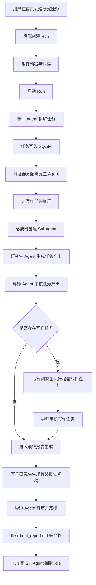

# ResearchGroup-Agent 架构与多 Agent 运行机制报告

**生成时间：** 2026-05-12
**项目路径：** `E:\GitHub\Repositories\ResearchGroup-Agent`
**报告范围：** 当前本地代码实现，包括前端、后端、运行流程、多 Agent 协作、AI 调用方式、记忆边界与系统边界。

---

## 1. 项目定位

ResearchGroup-Agent 是一个本地运行的多 Agent 研究协作模拟系统。它把“研究生课题组”的工作流抽象成：

1. 用户创建研究课题。
2. 导师 Agent 拆解任务。
3. 调度器按能力矩阵分配给不同研究生 Agent。
4. 研究生 Agent 执行任务，必要时临时创建 SubAgent。
5. 导师 Agent 审核每个任务产出。
6. 写作研究生整合所有已审核产出，形成最终报告初稿。
7. 导师 Agent 对最终报告初稿进行终审并定稿。
8. 系统保存 Markdown 报告、阶段审核汇总、任务产出、运行日志与成本记录。

系统当前是“自研轻量 Agent 编排系统”，没有直接使用 LangChain、LangGraph、AutoGen、CrewAI 等现成 AI Agent 框架。

---

## 2. 前后端总体架构

### 2.1 架构形态

系统采用典型的前后端分离架构：

```text
浏览器 / Next.js 前端
        |
        | REST API
        v
FastAPI 后端
        |
        | Repository 模式
        v
SQLite 本地数据库
        |
        | artifacts 文件目录
        v
Markdown 报告 / 日志 / 附件 / 运行产物

FastAPI 后端
        |
        | OpenAI-compatible chat/completions
        v
LLM Provider 或 Mock Provider
```

### 2.2 前端框架

前端位于 `frontend/`，主要技术栈：

| 层级     | 技术                                                |
| -------- | --------------------------------------------------- |
| 应用框架 | Next.js 16 App Router                               |
| UI 框架  | React 19                                            |
| 样式     | Tailwind CSS v4                                     |
|          |                                                     |
| 组件基础 | shadcn/ui v4、Base UI、lucide-react                 |
| 类型系统 | TypeScript                                          |
| API 封装 | `frontend/src/lib/api.ts`                           |
| 页面     | 首页、任务板、Agent、输出中心、像素办公室、运行详情 |

前端通过 `NEXT_PUBLIC_API_BASE` 或默认 `http://localhost:8000/api` 调用后端。

主要页面：

| 页面       | 文件                                         | 职责                                            |
| ---------- | -------------------------------------------- | ----------------------------------------------- |
| 首页       | `frontend/src/app/page.tsx`                  | 创建研究任务、上传附件、运行前预检、删除运行    |
| 任务板     | `frontend/src/app/tasks/page.tsx`            | 按运行查看任务状态，已完成任务归档              |
| Agent 页面 | `frontend/src/app/agents/page.tsx`           | 查看研究生 Agent 信息                           |
| 输出中心   | `frontend/src/app/outputs/page.tsx`          | 查看任务产出、审核汇总、最终报告，渲染 Markdown |
| 像素办公室 | `frontend/src/app/office/page.tsx`           | 以像素办公室可视化 Agent 状态                   |
| 运行详情   | `frontend/src/app/runs/[run_id]/page.tsx`    | 查看单次运行详情、事件、用量                    |
| 系统设置   | `frontend/src/components/settings-panel.tsx` | 前端编辑配置并同步`.env`                        |

### 2.3 后端框架

后端位于 `backend/`，主要技术栈：

| 层级      | 技术                             |
| --------- | -------------------------------- |
| Web 框架  | FastAPI                          |
| ASGI 服务 | Uvicorn                          |
| 数据模型  | Pydantic v2                      |
| 配置      | pydantic-settings +`.env`        |
| 数据库    | SQLite                           |
| 数据访问  | 自研 Repository 模式             |
| LLM 调用  | httpx 调 OpenAI-compatible API   |
| PDF 解析  | pypdf                            |
| 日志      | 自研 logger + FastAPI middleware |

后端入口是 `backend/main.py`。启动时会：

1. 初始化日志。
2. 创建 FastAPI app。
3. 初始化 SQLite 表结构。
4. 从 `backend/app/data/seed_agents.json` 加载初始 Agent。
5. 注册 REST API 路由。

主要路由：

| 路由文件             | 职责                                                   |
| -------------------- | ------------------------------------------------------ |
| `routes_runs.py`     | 创建运行、预检附件、启动/取消/删除运行、事件与用量查询 |
| `routes_tasks.py`    | 任务查询                                               |
| `routes_agents.py`   | Agent 查询                                             |
| `routes_outputs.py`  | 输出查询                                               |
| `routes_monitor.py`  | 像素办公室状态聚合                                     |
| `routes_settings.py` | 获取/更新配置并同步`.env`                              |
| `routes_logs.py`     | 前后端日志链路                                         |

---

## 3. 数据存储与运行产物

### 3.1 SQLite 表

数据库初始化位于 `backend/app/storage/db.py`。当前核心表：

| 表           | 作用                                                 |
| ------------ | ---------------------------------------------------- |
| `agents`     | 存储导师/研究生 Agent 基础信息、技能、状态、当前负载 |
| `runs`       | 一次研究运行的主记录                                 |
| `tasks`      | 导师拆解出的任务                                     |
| `subagents`  | 临时 SubAgent 记录                                   |
| `outputs`    | 任务产出、SubAgent 产出、审核结果、最终报告          |
| `run_events` | 运行事件流                                           |
| `llm_usage`  | LLM 调用成本、token、延迟、成功失败信息              |

### 3.2 artifacts 文件

运行产物会写入：

```text
artifacts/runs/{run_id}/
```

常见文件：

| 文件                     | 内容                              |
| ------------------------ | --------------------------------- |
| `final_report.md`        | 最终研究报告                      |
| `review_summary.md`      | 导师阶段审核汇总                  |
| `writer_final_draft.md`  | 写作研究生最终报告初稿            |
| `tasks.json`             | 当前运行任务快照                  |
| `agent_assignments.json` | 任务分配信息                      |
| `run_log.md`             | 运行日志摘要                      |
| `inputs/`                | 用户上传的附件和提取后的 Markdown |

---

## 4. 当前使用的 AI 方式

### 4.1 是否使用 AI 框架

当前没有使用 LangChain、LangGraph、AutoGen、CrewAI 等 AI Agent 框架。

项目中存在 `agent_orchestrator.py`、`external_memory.py`、`tool_provider.py` 等预留接口，但这些文件当前只是 stub 或 NotImplemented，不参与主流程。

实际 AI 能力由以下两类 Provider 提供：

| Provider                   | 文件                               | 作用                                           |
| -------------------------- | ---------------------------------- | ---------------------------------------------- |
| `MockLLMProvider`          | `backend/app/core/llm_provider.py` | Mock 模式下返回模拟结果                        |
| `OpenAICompatibleProvider` | `backend/app/core/llm_provider.py` | 调用 OpenAI-compatible`/chat/completions` 接口 |

是否使用真实模型由 `.env` 中的 `MOCK_MODE` 决定。真实模型配置包括：

```text
LLM_API_KEY
LLM_BASE_URL
LLM_MODEL_NAME
ADVISOR_MODEL_NAME
GRADUATE_MODEL_NAME
SUBAGENT_MODEL_NAME
```

### 4.2 Prompt 组织方式

Prompt 没有硬编码在模型层，而是按角色放在：

```text
backend/app/prompts/
```

主要 Prompt：

| Prompt 文件            | 对应角色      |
| ---------------------- | ------------- |
| `advisor_agent.md`     | 导师 Agent    |
| `grad_researcher.md`   | 文献研究生    |
| `grad_engineer.md`     | 工程研究生    |
| `grad_experimenter.md` | 实验研究生    |
| `grad_analyst.md`      | 分析研究生    |
| `grad_writer.md`       | 写作研究生    |
| `subagent.md`          | 临时 SubAgent |

运行时由 `prompt_loader` 加载，并拼接任务上下文形成最终 LLM 请求。

---

## 5. 多 Agent 角色设计

系统当前核心 Agent 来自 `backend/app/data/seed_agents.json`。

| Agent 类型 | ID                     | 主要职责                       |
| ---------- | ---------------------- | ------------------------------ |
| 文献研究生 | `grad_researcher`      | 文献调研、背景分析、相关工作   |
| 工程研究生 | `grad_engineer`        | 系统设计、工程方案、工具链分析 |
| 实验研究生 | `grad_experimenter`    | 实验设计、评测方案、对比实验   |
| 分析研究生 | `grad_analyst`         | 数据分析、指标解释、结果归纳   |
| 写作研究生 | `grad_writer`          | 汇总调研产出，起草最终报告     |
| 导师 Agent | 由 advisor prompt 承担 | 拆解任务、审核任务、终审报告   |
| SubAgent   | 临时生成               | 协助复杂且可拆解的任务         |

每个研究生 Agent 有技能矩阵：

```text
literature_review
coding
experiment
data_analysis
academic_writing
mentoring
```

调度器会根据任务所需技能和 Agent 当前负载选择负责人。

---

## 6. 具体运行流程

核心运行服务是：

```text
backend/app/services/run_execution_service.py
```

一次运行的主流程如下：



### 6.1 创建运行

前端调用：

```text
POST /api/runs/preflight
POST /api/runs
POST /api/runs/{run_id}/start
```

后端在 `routes_runs.py` 中处理：

1. 生成 `run_{8位hex}`。
2. 对附件做预检。
3. 保存附件到 `artifacts/runs/{run_id}/inputs/`。
4. PDF 尽量用 `pypdf` 抽取文本，并写成 Markdown 上下文。
5. 将用户研究目标和附件上下文合并到 `research_goal`。
6. 写入 `runs` 表。

### 6.2 导师拆解任务

服务：

```text
backend/app/services/task_decomposer.py
```

它会调用导师 Prompt，要求 LLM 返回 3-7 个 JSON 任务。任务字段包括：

```text
title
description
task_type
priority
complexity
decomposability
required_skills
```

任务类型包括：

```text
literature_survey
system_design
experiment_design
result_analysis
report_writing
```

每个任务会写入 `tasks` 表，初始状态为 `pending`。

### 6.3 调度器分配任务

服务：

```text
backend/app/services/task_scheduler.py
```

调度逻辑是自研规则，不是 AI 模型决策。

核心评分：

```text
score = skill_match * scheduler_skill_weight
      + idle_factor * scheduler_idle_scale * scheduler_idle_weight
```

默认配置：

```text
scheduler_skill_weight = 0.7
scheduler_idle_weight = 0.3
scheduler_idle_scale = 100
```

含义：

| 指标            | 含义                                      |
| --------------- | ----------------------------------------- |
| `skill_match`   | Agent 技能与任务 required_skills 的匹配度 |
| `idle_factor`   | Agent 当前负载越低越优先                  |
| `primary_skill` | 本任务最关键的技能                        |
| `score`         | 最终调度分                                |

如果任务复杂度较高或负责人负载较高，会尝试分配 collaborator。

### 6.4 研究生 Agent 执行任务

服务：

```text
backend/app/services/task_executor.py
```

执行时按负责人类型选择 Prompt：

| Agent 类型     | Prompt                 |
| -------------- | ---------------------- |
| `researcher`   | `grad_researcher.md`   |
| `engineer`     | `grad_engineer.md`     |
| `experimenter` | `grad_experimenter.md` |
| `analyst`      | `grad_analyst.md`      |
| `writer`       | `grad_writer.md`       |

研究生 Agent 输出要求是 JSON，解析后写入：

1. `tasks.outputs`
2. `outputs` 表中的 `task_result`

### 6.5 SubAgent 触发与执行

服务：

```text
backend/app/services/subagent_service.py
```

SubAgent 不是常驻角色，而是临时子任务执行器。

触发条件：

```text
task.complexity >= subagent_complexity_threshold
task.decomposability >= subagent_decomposability_threshold
parent_agent.skills.mentoring >= subagent_mentoring_threshold
```

默认阈值：

```text
subagent_complexity_threshold = 6
subagent_decomposability_threshold = 7
subagent_mentoring_threshold = 6
```

执行过程：

1. 父 Agent 判断是否需要 SubAgent。
2. 创建 `subagent_{8位hex}`。
3. 写入 `subagents` 表。
4. 将任务状态改为 `waiting_subagent`。
5. 使用 `subagent.md` Prompt 调用 LLM。
6. 将结果写回 `subagents.result`。
7. 同时写入 `outputs` 表，类型为 `subagent_result`。
8. 生命周期标记为 `destroyed`。

SubAgent 的结果不会直接进入最终报告，而是作为父任务相关产物的一部分，后续仍要经过研究生整合和导师审核。

### 6.6 导师审核任务产出

服务：

```text
backend/app/services/review_service.py
```

导师审核输入：

1. 任务标题。
2. 任务类型。
3. 任务描述。
4. 任务产出 JSON。

导师输出 JSON：

```json
{
  "approved": true,
  "feedback": "审核意见"
}
```

如果 `approved = true`，任务状态变为 `completed`。
否则任务状态变为 `need_revision`。

审核结果也会作为 `review` 类型写入 `outputs` 表。

### 6.7 写作研究生与最终报告

服务：

```text
backend/app/services/report_service.py
```

这里有两个层次的报告：

| 输出                    | 生成者                       | 作用                                 |
| ----------------------- | ---------------------------- | ------------------------------------ |
| `review_summary.md`     | 系统汇总导师每个任务审核结果 | 阶段性审核记录，不是最终研究报告     |
| `writer_final_draft.md` | 写作研究生 Agent             | 基于已完成任务和审核意见起草最终报告 |
| `final_report.md`       | 导师 Agent 终审定稿          | 最终给用户下载/阅读的研究报告        |

最终报告流程：

```text
已完成任务产出
    ↓
导师阶段审核汇总
    ↓
写作研究生生成最终报告初稿
    ↓
导师 Agent 审核、修正、定稿
    ↓
保存 final_report.md
```

因此，“最终报告”不是某一次任务审核结果，而是写作研究生综合全部调研结果后，再由导师终审形成的报告。

---

## 7. 多 Agent 之间如何通信

当前系统没有实现真正的多 Agent 自由对话，也没有消息队列或实时群聊机制。多 Agent 之间的通信是“状态机 + 数据库 + Prompt 上下文”的间接通信。

### 7.1 通信载体

| 通信内容       | 存储位置                                                                   |
| -------------- | -------------------------------------------------------------------------- |
| 任务分配       | `tasks.owner_agent`、`tasks.collaborator_agents`、`runs.agent_assignments` |
| 任务产出       | `tasks.outputs`、`outputs` 表                                              |
| SubAgent 结果  | `subagents.result`、`outputs` 表                                           |
| 导师审核意见   | `tasks.review_result`、`tasks.review_feedback`、`outputs` 表               |
| 运行事件       | `run_events` 表                                                            |
| 最终报告上下文 | `report_service` 从 tasks、outputs、reviews 汇总                           |

### 7.2 通信方式

实际通信不是：

```text
Agent A 直接发消息给 Agent B
```

而是：

```text
Agent A 产出结构化结果
        ↓
写入数据库
        ↓
后续服务读取这些结果
        ↓
拼进 Agent B 的 Prompt
        ↓
Agent B 基于上下文继续工作
```

示例：

1. 文献研究生完成文献调研，结果写入 `task.outputs`。
2. 导师审核该任务，审核意见写入 `review_result`。
3. 写作研究生生成最终报告初稿时，`report_service` 会读取所有已完成任务产出和导师审核汇总。
4. 导师终审最终报告时，会读取写作研究生初稿、任务产出索引、审核汇总。

这种方式的优点是可追踪、可审计、状态清晰。缺点是 Agent 之间不是自由协商式通信。

---

## 8. 多 Agent 记忆机制与边界

### 8.1 当前有哪些记忆

当前系统的“记忆”主要是结构化运行记忆，而不是长期语义记忆。

| 记忆类型           | 是否存在 | 说明                                                  |
| ------------------ | -------- | ----------------------------------------------------- |
| 单次运行记忆       | 有       | Run、Task、Output、Review、Event、Usage 全部存 SQLite |
| Agent 当前负载记忆 | 有       | `agents.current_load`、`agents.current_tasks`         |
| SubAgent 临时记忆  | 有       | 执行期间存在，结果持久化，生命周期标记 destroyed      |
| 最终报告文件记忆   | 有       | 写入 artifacts                                        |
| 长期向量记忆       | 无       | `external_memory.py` 是预留 stub                      |
| 跨运行自动学习     | 无       | 没有根据历史运行自动更新 Agent 能力                   |
| 工具调用记忆       | 无       | `tool_provider.py` 是预留 stub                        |

### 8.2 Agent 记忆边界

每个 Agent 并没有独立的长期记忆库。它能“知道”的内容来自当前服务拼给它的 Prompt：

1. 自己的角色 Prompt。
2. 当前任务标题、描述、类型。
3. 当前任务已有产出。
4. 导师审核意见。
5. 报告生成阶段读取到的全局任务摘要。

Agent 不会自动读取全数据库，也不会跨运行主动记住以前做过的研究。

### 8.3 SubAgent 边界

SubAgent 的边界更严格：

1. SubAgent 只服务于一个父任务。
2. SubAgent 不能创建新的 SubAgent。
3. SubAgent 不访问全局运行上下文。
4. SubAgent 的生命周期是 `destroy_after_return`。
5. 执行后只保留结构化结果，不保留独立长期记忆。

### 8.4 导师 Agent 边界

导师 Agent 当前承担三个关键动作：

1. 拆解研究目标。
2. 审核任务产出。
3. 终审最终报告。

导师 Agent 不做的事：

1. 不直接替代所有研究生完成任务。
2. 不绕过任务板状态机。
3. 不让 SubAgent 结果直接进入最终报告。
4. 不自动调用外部科研工具。

---

## 9. 系统边界与未实现能力

当前项目里有一些预留接口，但 MVP 阶段未真正实现。

| 模块                      | 当前状态       | 说明                                       |
| ------------------------- | -------------- | ------------------------------------------ |
| `agent_orchestrator.py`   | 未实现         | 预留给 LangGraph/AutoGen/CrewAI 等复杂编排 |
| `external_memory.py`      | 未实现         | 预留给向量库或长期记忆                     |
| `tool_provider.py`        | 未实现         | 预留给外部工具调用                         |
| `skill_update_service.py` | 未实现或弱实现 | 预留给能力动态更新                         |

因此当前系统不是一个“全自动科研平台”，而是一个状态机驱动的多 Agent 研究流程模拟系统。

---

## 10. 前端运行体验

### 10.1 首页

首页支持：

1. 输入研究目标。
2. 上传 PDF、Markdown、文本、图片等附件。
3. 运行前预检。
4. 创建并启动运行。
5. 查看最近运行。
6. 删除已结束或未启动的运行。

图片附件需要真实多模态模型。Mock 模式或模型不支持图片时，预检会阻止或提示。

### 10.2 任务板

任务板按运行展示任务状态：

1. 默认选择最新运行。
2. 只把未完成任务放在主看板。
3. 已完成任务进入归档区。
4. 可查看任务详情、调度信息和产出。

### 10.3 像素办公室

像素办公室通过 `routes_monitor.py` 聚合运行状态、Agent 状态、任务状态和 SubAgent 状态，以像素风格展示：

1. 各类研究生办公区。
2. 导师办公室。
3. 任务看板。
4. 休息区。
5. 临时工位。

当 Agent 无工作时应回到休息区或待命状态；运行完成后 `run_execution_service._reset_agents()` 会把相关 Agent 状态重置为 `idle`。

### 10.4 输出中心

输出中心支持：

1. 默认选择最新运行。
2. 按任务筛选产出。
3. 按产出类型筛选。
4. 渲染最终 Markdown 报告。
5. 下载 `.md` 文件。
6. 查看写作初稿、导师审核汇总、任务产出、SubAgent 产出。

---

## 11. 设置与配置同步

系统设置面板位于：

```text
frontend/src/components/settings-panel.tsx
```

后端接口位于：

```text
backend/app/api/routes_settings.py
```

支持前端编辑：

1. Mock 模式。
2. API Key。
3. Base URL。
4. 默认模型、导师模型、研究生模型、SubAgent 模型。
5. LLM 超时、重试次数。
6. 调度权重。
7. SubAgent 阈值。
8. 成本估算参数。
9. 日志级别。

保存后：

1. 更新当前后端进程中的 `settings`。
2. 写回项目根目录 `.env`。

注意：端口等启动期配置写入 `.env` 后，一般需要重启服务才能完全生效。

---

## 12. 本地启动流程

### 12.1 后端

```bash
cd backend
pip install -r requirements.txt
python main.py
```

默认地址：

```text
http://127.0.0.1:8000
```

健康检查：

```text
GET /api/health
```

### 12.2 前端

```bash
cd frontend
npm install
npm run dev
```

默认地址：

```text
http://localhost:3000
```

### 12.3 构建和检查

```bash
cd frontend
npm run lint
npm run build
```

---

## 13. 关键结论

1. 当前系统采用 Next.js + React + Tailwind 的前端，FastAPI + SQLite 的后端。
2. 多 Agent 编排是项目自研服务实现，不依赖 LangChain、CrewAI、AutoGen 等 AI Agent 框架。
3. Agent 之间不是自由对话，而是通过任务状态、数据库记录、产出、审核意见和 Prompt 上下文间接通信。
4. 写作研究生不会一开始就直接写最终报告；当前流程是先完成并审核研究任务，再由写作研究生起草报告，最后导师定稿。
5. 当前记忆是运行级结构化记忆，没有长期向量记忆，也没有跨运行自主学习。
6. SubAgent 是临时助手，生命周期短，结果必须回到父任务和导师审核链路，不会绕过研究生 Agent 或导师 Agent。
7. 系统边界清晰：MVP 重点是“任务板状态机 + 多 Agent 模拟协作 + Markdown 报告产出”，不是完整科研自动化平台。
